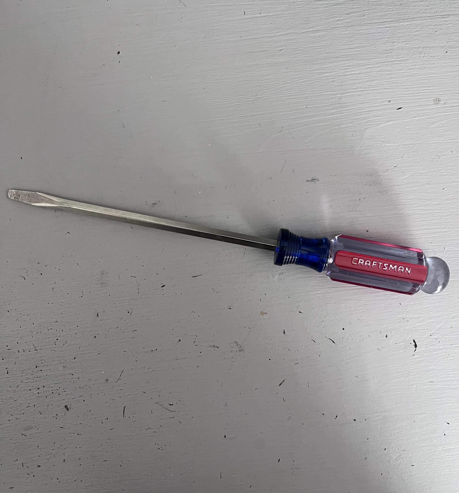
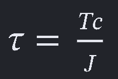
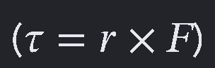
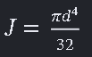

# A1 – [Build Professional Portfolio]

## Objective
Build Professional Portfolio
## Analyze
## Task A: Portfolio Analysis

**1.** [Viewing Zachlq's Professional Portfolio](https://github.com/Zachlq/Professional_Portfolio/tree/main)

- **a.** —Viewing Zach's Portfolio on GitHub, the Portfolio work is located under Dashboards. Zach has three assignments shown. The navigability of the portfolio as a reader is easy to follow and concisely organized. I am able to locate a specific assignment or piece of work in under 60 seconds.
- **b.** — In Zach's portfolio, the work shown is all data-analyzed graphs. Since Zach is a data engineer, the majority of his work is charts and graphs. Within each PNG file, the sources from his data analytics are shown, but it is difficult to be able to reproduce with only the sources shown. Zach does not provide the thought process of organizing or the reasoning behind why he included the data rather than other data that connected to the same idea. The sources Zach put within his graphs do not help with the reasoning throughout making the graphs. 
- **c.** — As stated, Zach's graphs only show what the final answer is. The thought process is not included in the work. This being a data engineer portfolio, the sources of his data are hard to find besides the websites he has used at the bottom.
- **d.** — Zach's portfolio does contain professional language throughout, to the standard of a document you would hand to an employer. The audience would be other data engineers or employers at TED Talk, and the vocabulary does fit. The purpose of the graphics would be to concisely explain how the company is benefiting from the member campaign. The data is measured through surveys and analytics from websites listed below the graphics. As for the measure of tone, the wording is concise and spaced out logically throughout the visuals. 

**2.** [Viewing Thanh Tran's Professional Portfolio](https://thanhvtran.com/)

- **a.** — Viewing Thanh Tran's portfolio, Thanh's work is organized under the Projects section link. As a reader, this is helpful and quick; I can locate all assignments and works this person has made in under 60 seconds. The actual projects/work are under their own hyperlink and section and can be quickly seen by clicking the picture of any. Projects/Work is also divided into categories of Internships, Personal, and Student Teams.
- **b.** — Using the Apple Internship as an example, the documentation does not contain enough information specifically for the Apple internship, since the video in that section does not work and gives a vague description. He does say he can only disclose so much. As for the Braking Calipers under Student Teams, it is well informed by data, calculations, drawings, and dimensions. This shows the thought process behind every step Thanh made; this can be reproduced without asking a question due to the amount of descriptions and information shared.
- **c.** — From the work shown on the Brake Calipers, the evidence Thanh shares shows how decisions were made. As for the Apple Internship, it is reasonable that information is limited due to the policies of the company itself.  The Brake Caliper project, along with the FSAE Suspension Uprights project, these works shows the thought process and shows data and calculations providing dimensions.
- **d.** — Thanh's portfolio does contain language that meets the standard of a document you would hand to an employer. This portfolio has ease of understanding logical for any aspiring engineer or future employer due to the amount of work shown on the Brake Caliper project. The purpose of the dimensions and data from the Brake Caliper and FSAE Suspension Uprights show the engineering design thought process. The data shows the loads and stresses applied. This data also shows necessary dimensions based on these loads and stresses.

## Task B: Product Analysis

**1.** Screwdriver

- **a.** — Using a simple mechanical product that produces some physical property to show the analysis process in action, such as a screwdriver. The primary function of a screwdriver is to transmit rotational torque to a screw to tighten or loosen it. The mechanical tasks include transmitting torque, rotating the screw, and applying axial and torsional stresses to the screw.

- **b.** — Connecting both the mathematical and physical properties of the screwdriver, the screwdriver relies on multiple components. To connect and numerically view these components to the function of a screwdriver, divide the screwdriver into two components: the handle and the shaft. The governing model equation for the screwdriver shaft is Tau(max) equals T(torque) multiplied by C(the outer radius), divided by J(polar moment of inertia of the cross section). The governing model equation used for the handle is Tau(torque) equals F(force) multiplied by r(distance).

  Explaining what each term means from the shaft component: Tau(max) is the maximum shear stress in the screwdriver shaft, T(torque) is what's applied, C is the outer radius of the shaft, and J is the polar moment of inertia of the shaft cross-section. This equation can be seen in eq 1.

   (eq 1)

  Explaining what each term means from the handle component: Tau(torque) is the applied torque, F(force) is the force applied by your hand, and r(distance) is the effective distance from the screwdriver's axis. This equation can be seen in eq 2.

   (eq 2)

  A critical assumption would be that the screwdriver shaft is treated as a uniform, solid, circular shaft made of a homogeneous material.

- **c.** — 

  The handle has a large diameter and an easy-to-use grip. This allows the user to apply force and torque while maintaining a secure grip. The large radius increases the moment arm from the hand force to the screwdriver's rotational axis. This allows for greater torque to be generated, according to T(torque) equaling F(force) multiplied by r(distance) (eq 2).

  

  The metal shaft is a long cylindrical component assumed throughout. The shaft transmits torque from the handle to the screw. Since the assumed circular cross-section creates torsional loading, the equation tau(max) equals T(torque) multiplied by C(the outer radius), all divided by J(moment of inertia of the cross-section), is used (eq 1). J is a standardized equation for circular cross-sections; this standardized equation can be seen below in eq 3 using the diameter (d) of a circle.

   (eq 3)

- **d.** — [Patent Author: Marian Iskra (Patent Number: US 3,985,170)](https://patents.google.com/patent/US3985170A/en)

  Marian Iskra invented a screwdriver with a bit that was effective in build and cost, prevented slip-out, and transmitted maximum torque. 

  Two alternatives that can be used in today's time include an electric/cordless screwdriver. This performs the same basic function: it rotates a screwdriver bit to tighten or loosen screws. But the difference is that instead of the user's hand supplying the torque, an electric motor supplies the rotational energy.

  Another alternative includes a ratcheting screwdriver; this also does the same basic function. But the difference is that a ratcheting mechanism allows the handle to rotate in one direction while the bit remains engaged with the screw.

  One design decision the original engineer made was to add the square-shaped guide spigot to the center of the flat screwdriver blade. The engineer stated, "The square cross section spigot is preferred because it is strong and is easy to manufacture." I believe the reason for this is that it improves the amount of applied torque while also being cost-effective.

## Decide
- **1. Homepage Identity** — The purpose of using the homepage is to instantly give the impression that the content within this portfolio involves mechanical engineering and engineering designs. The machining picture was selected to provide visitors with a visual link between the engineering, manufacturing, and the precision involved in such tasks. The use of the picture and the precision involved in it creates an expectation that the assignments and projects will be accurate and professional. As for how the portfolio is organized, each major section is labeled in the leftmost column. In the assignments section, there is a dropdown arrow that extends to the list of all the engineering assignments provided in this portfolio, and each assignment has its own dedicated sub-sections that express the engineering design process. As the course progresses, the homepage will contain links to each assignment for ease of use. The homepage will also contain a concise description of what the assignment is about, as well as a visual representation. This format will allow for a professional, organized look and ease of understanding for visitors of this portfolio
- **2. One Intentional Customization** — Decided to modify the section label “Assignments” used in the navigation section to “Engineering Assignments.” Initially, the label “Assignments” was too generic and failed to specify to a visitor the nature of the content in that section. The addition of the word “Engineering” ensures that the purpose of the section is made known to visitors before opening the assignments. Another change would be the section label name change from About Me to About the Engineer. This change is functional because this portfolio needs to communicate professionalism and purpose to visitors and future employers. The section label About Me is broad and misleading to more personal information rather than information that connects the creator of the portfolio to the contents of the portfolio.  
- **3. Documentation Standard** — Every engineering design and assembly will clearly document the engineering process, present the required analysis and results, and meet all stated requirements.

## Communicate
Info in section labeled "About the Engineer"

Spent around 7.5 hours on this assignment
