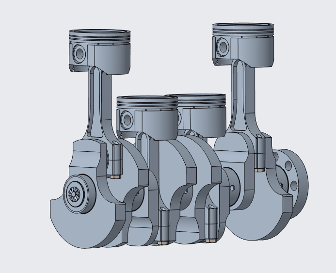
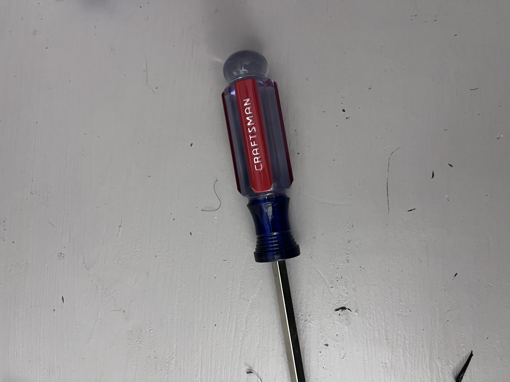
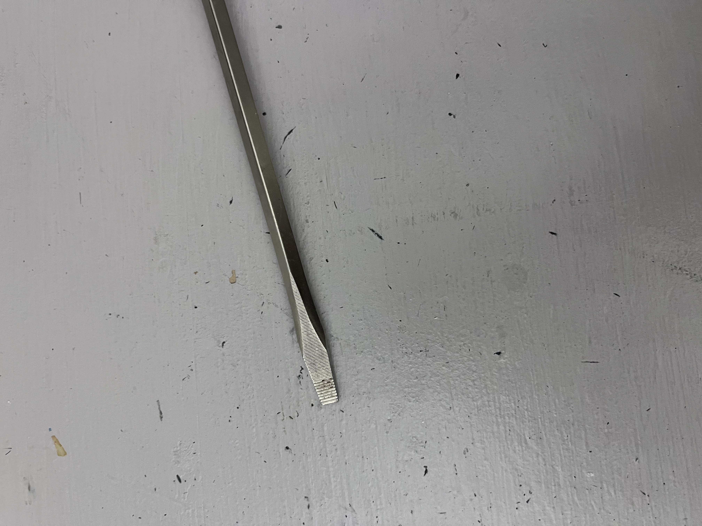

# A1 – [Topic]
## markdown?

## Objective
## Task A 
  1. [Viewing Zachlq's Professional_Portfolio](https://github.com/Zachlq/Professional_Portfolio/tree/main)
    a. Navigability: Yes, as a reader, I am able to locate a specific assignment or piece of work in under 60 seconds. Work is under Dashboards.
    b. Reproducibility: The documentation does not contain enough information for a colleague to reproduce the work without asking questions. Documentation of his work is in .png files, but it does show enough context and visuals. Since the person is a data engineer, the majority of his work is charts and graphs. 
    c. Evidence of reasoning: The portfolio only shows what the final answer was. This being a data engineer portfolio, the sources of his data are hard to find besides the websites he has used at the bottom. 
    d. Professional tone: Yes, the language meets the standard of a document you would hand to an employer. The audience would be other data engineers or employers at TED Talk, and the vocabulary does fit. The purpose of the graphics would be to concisely explain how the company is benefiting from the member campaign. The data is measured through surveys and analytics from websites listed below the graphics.

  2. [Viewing Thanh Tran's Professional Portfolio](https://thanhvtran.com/)
     a. Navigability: Yes, as a reader, I can locate all assignments and works this person has made in under 60 seconds. Work is under its own hyperlink and section. Work is also divided into categories of Internships, Personal, and Student Teams.
     b. Reproducibility: The documentation does not contain enough information specifically for the Apple internship, since the video in that section does not work and just gives a vague description. He does say he can only disclose so much. As for the Braking Calipers under Student Teams, it is well informed by his data, calculations, and drawings. This which can be reproduced without asking a question.
     c.  Evidence of reasoning: The portfolio does show how decisions were made only on some projects such as the Brake Caliper, but not for the Apple Internship. The Brake Caliper project this person did clearly shows his thought process and shows data and calculations providing dimensions.
     d. Professional tone: Yes, the language meets the standard of a document you would hand to an employer. This portfolio is clear to any aspiring engineer or future employer due to the amount of work shown on the Brake Caliper project. The purpose of the dimensions and data from the Brake Caliper show the engineering design thought process. The data shows the loads and stresses applied. This data also shows necessary dimensions based on these loads and stresses.

## Task B
[Screwdriver](https://patents.google.com/patent/US3985170A/en)
     a. The primary function of a screwdriver is to transmit rotational torque to a screw to tighten or loosen it. The mechanical tasks include transmitting torque, rotating the screw, and applying axial and torsional stresses to the screw.
     b. The governing model equation is tau(max) equals T(torque) multiplied by C(the outer radius), all divided by J(moment of inertia of cross section). Another equation used would be T(torque) equals F(force) multiplied by r(distance)
      Where tau(max) is the maximum shear stress in the screwdriver shaft, T(torque) is what's applied, C is the outer radius of the shaft, and J is the polar moment of inertia of the shaft cross-section. 
      Where T(torque) is the applied torque, F(force) is the force applied by your hand, and r(distance) is the effective distance from the screwdriver's axis
    An assumption would be that the screwdriver shaft is treated as a uniform, solid, circular shaft made of a homogeneous material.
     c. 
        The handle has a large diameter and an easy-to-use grip. This allows the user to apply force and torque while maintaining a secure grip. The large radius increases the moment arm from the hand force to the screwdriver's rotational axis. This allows for greater torque to be generated, according to T(torque) equaling F(force) multiplied by r(distance).
     
         The metal shaft is a long cylindrical component assumed all throughout. The shaft transmits torque from the handle to the screw. Since the assumed circular cross-section creates torsional loading, the equation  tau(max) equals T(torque) multiplied by C(the outer radius), all divided by J(moment of inertia of cross section), is used. J is a standardized equation for circular cross-sections.
     d. Patent Number: US 3,985,170
       Patent Author: Marian Iskra
       Two Alternatives include an electric/cordless screwdriver. This performs the same basic function: it rotates a screwdriver bit to tighten or loosen screws. But the difference in user's hand supplying the torque, an electric motor supplies the rotational energy. Another alternative includes a ratcheting screwdriver; this also does the same basic function. But the difference is that a ratcheting mechanism allows the handle to rotate in one direction while the bit remains engaged with the screw.
       One design decision the original engineer made was to add the square-shaped guide spigot to the center of the flat screwdriver blade. The engineer stated, "The square cross section spigot is preferred because it has been found to be strong and is easy to manufacture." I believe the reason of this improves the amount of applied torque while also being cost-effective.  
## Analyze

## Decide

## Communicate

