# A3 – [Parametric and FEA]

## Objective

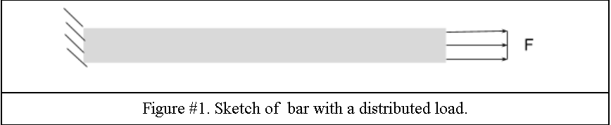
This project involves the parametric design of an aluminum bar with a circular cross-section. The bar is subjected to a tensile force. The bar was analyzed and designed using deformation equations and listed values, then using Finite Element Analysis (FEA) and viewing different maps of the stresses and changes in the geometry of the bar. The design process was carried out automatically in the CAD model by relating the geometrical values to structural properties using the elongation equations found in the Machinery’s Handbook. Then FEA was carried out on the geometry to compare and contrast it with hand calculation models.

## Given and Constrained Values

From the given values of the maximum deflection (0.009 inches) and the yield stress of the Aluminum alloy (40 ksi), alongside the bar needing to have a circular cross-section. The assignment allowed us to choose the load force (F) within 300 to 500 lbf. The assignment also allowed us to choose a value for Young’s Modulus (E) within a range of 8.5 to 11.5 Mpsi.

These values can be seen implemented in the parametric equations picture as independent global values (CAD and FEA Analysis).

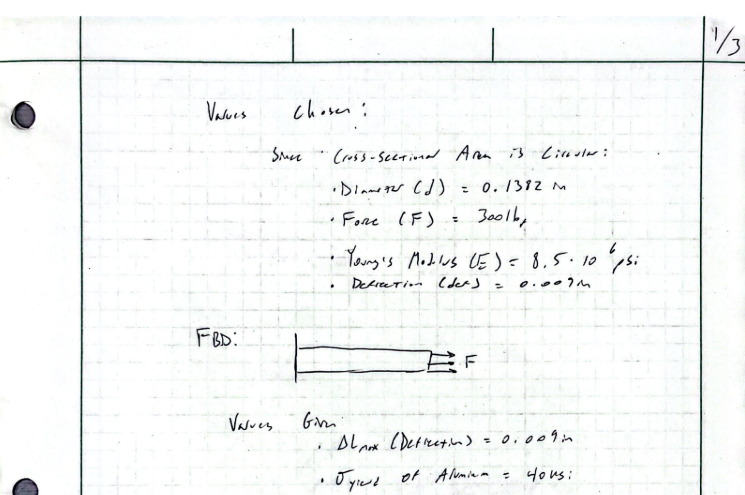

### Reasoning for the Elasticity value
The Modulus of Elasticity (E) was selected to be at the minimum of the stated range, 8.5 Mpsi, to develop a conservative design approach. The smaller the value of the modulus of elasticity in axial load application, the lower the stiffness of the material. This shows the smallest value of the modulus of elasticity as the worst case for deflection calculation. The elongation formula optimized the length of the rod that would meet the stringent requirement of 0.009 inches deflection at the minimum stiffness. This will allow the bar to pass through the parametric analysis in any case, even if the stiffer aluminum alloy is used.

### Reasoning for load value
The minimum threshold of force, which was set to 300 lbf, was chosen to achieve an optimal slender aspect ratio of the solid bar by minimizing its cross-sectional area to have sufficient material stress value for reaching a Factor of Safety (FOS) of 2.0 (as seen in the Stress Values picture). With a combination of a small force and a solid circular cross-section, the model’s calculated length allows for the gravitational sag to be negligible and not affect the simulation. A small geometrical configuration confines the rigid boundary conditions to a small region close to the fixed wall.

### Reasoning for solid circular cross-section over hollow
In this bar design, I chose a solid circular cross-section to better match the elongation equation used throughout the assignment under axial loading (the idealized elongation equation will be more discussed in the percent errors section). Using a solid circular cross-section ensures no internal walls that could cause radial deformation if the structure is clamped and loaded with 300 lbf. Having a solid cross-section makes sure that there is no possibility of introducing complex radial or shear deformations within the walls of a hollow bar during the FEA, causing higher percentage errors. A solid bar allows for a high slenderness ratio in relation to the length; this ensures that the rigid boundary constraints are only at the end faces of the bar.

### Elongation Equation
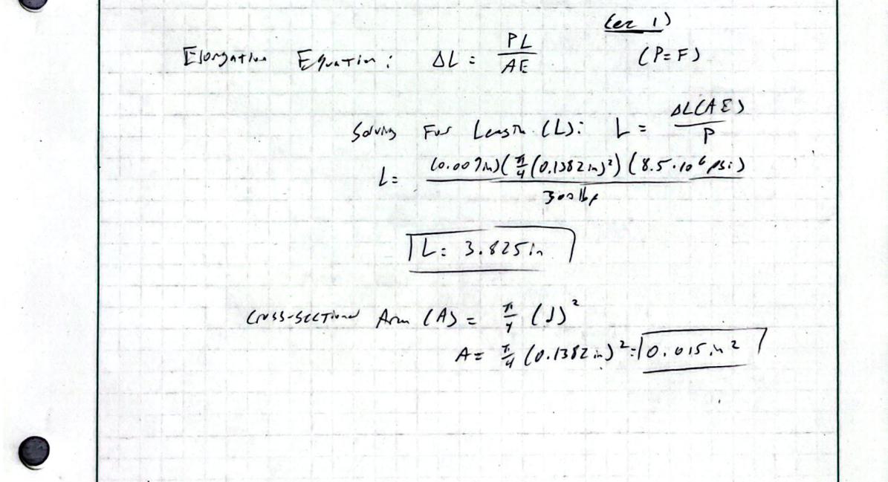

Hand calculation analysis was done using Machinery’s Handbook equation for Direct Tension Elongation in order to get a final dimension for the length (L) of the bar as 3.825 inches, with a diameter (d) of 0.1382 inches and an area (A) of 0.015 square inches. The derived values were assigned as constant and equation-driven Global Variables in the SolidWorks Equation Manager so that the whole 3D CAD model will automatically update if there is any change in load or material properties.

These calculated values can be seen in the parametric equation picture as the dependent global variables (CAD and FEA Analysis).

### Stress Values
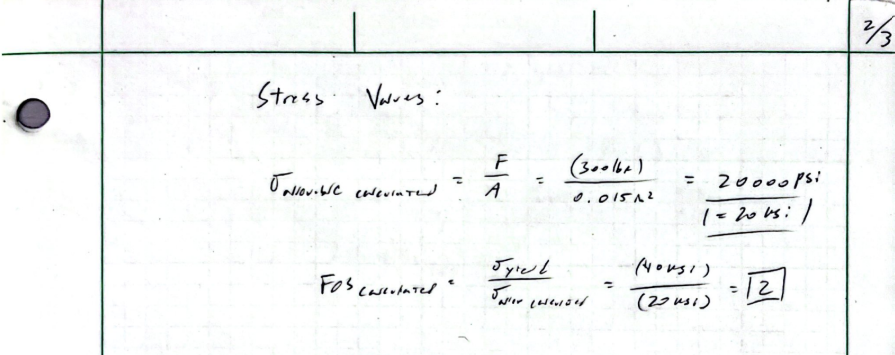

Here are the calculated values for the allowable stress from the calculated cross-sectional area.
The calculated FOS value is also listed using the given yield stress of the aluminum alloy over the allowable calculated stress.

These values are equivalent to the parametric values seen in the picture directly below as independent global variables(CAD and FEA Analysis).

## CAD and FEA Analysis
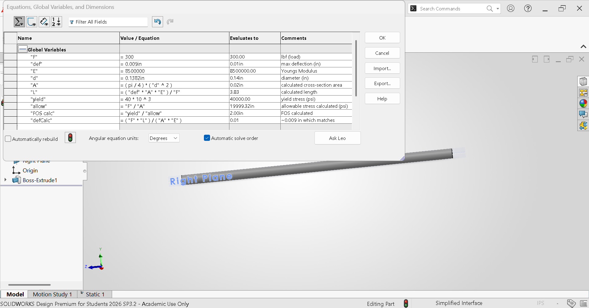
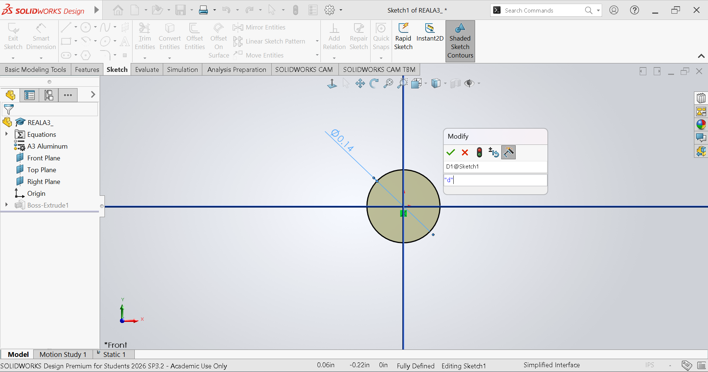
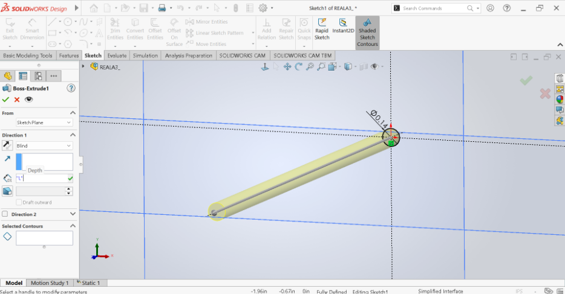

As seen above, the independent global variables (F, def, E, d, and yield) represent the independent constraints/given/chosen values of the project. The dependent variables (A, L, allow, FOS calc, defCalc) use the geometry of the circular cross-section along with the Machinery’s Handbook equation for direct tension  (eq 1 in the Stress Values picture) to solve for the necessary length. 

The parametric equations and the chosen values of the load, geometry, and material dynamically calculate the exact cross-sectional area and the length of the bar required to meet the deflection requirement. Parametric CAD modeling allows the model to automatically update its physical dimensions if any loading, material, or dimensional requirements change in the future.

### Loading
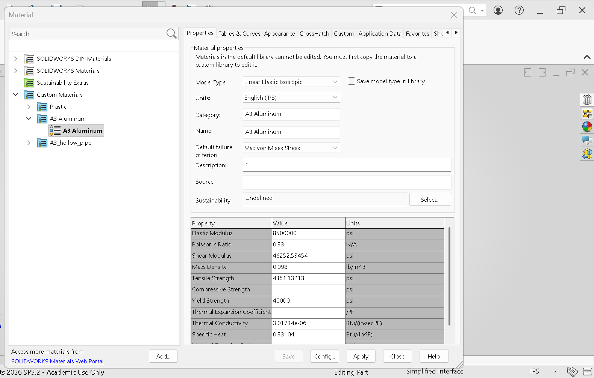
As seen, the material has the same aluminum values, with the exception of the Young’s Modulus (E) being 8.5Mpsi and the yield stress being the constrained 40 ksi.

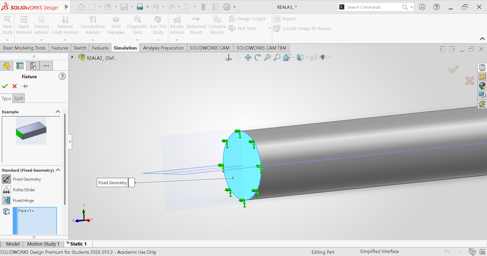
The picture shows the anchoring side of the bar. This was a requirement in the design process. 

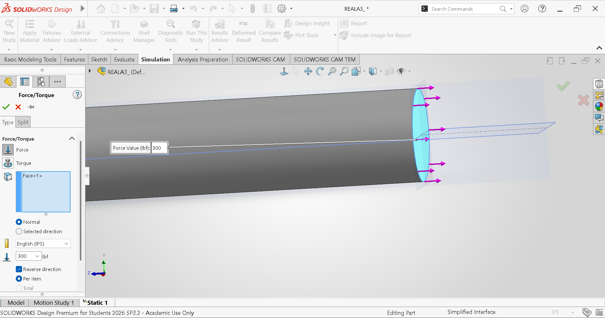
This picture shows the load the bar will experience in the FEA analysis. Had trouble trying to put the global variable I created in the value, but it did not work. As seen in the picture, I just put the numerical value that I chose. 

### FEA Analysis

#### Displacement Map
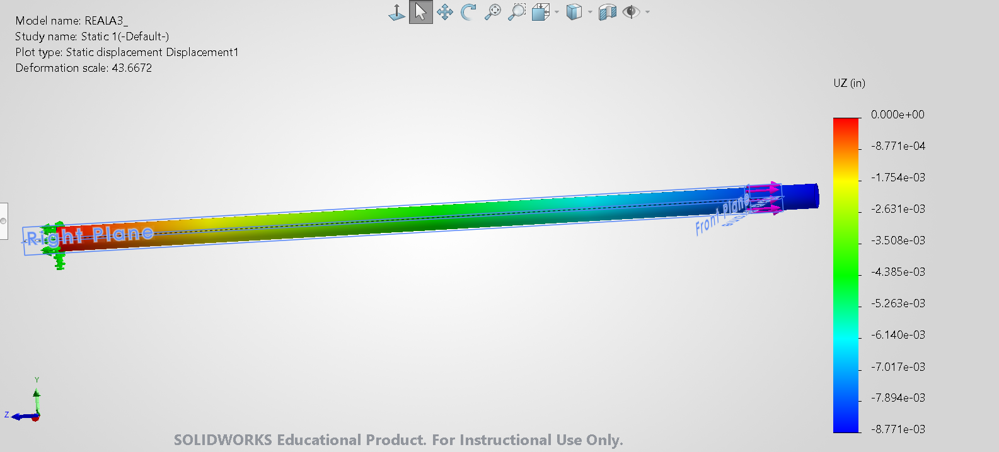
The above displacement graph is a graphical representation of the axial properties of the bar. The graph displays longitudinal strain (UZ) on a color scale where the fixed/anchored support stays at 0.000 inches (red), and the free end (blue) sustains the highest amount of tensile strain. The deflection value depicted on the blue tip of the graph equals -0.008771 inches. This result shows an almost direct match to the required design deflection limit. As for the sign of the deflection, this is due to the set orientation of SolidWorks and accidentally mismatching the positive orientation to the load, though the sign does not matter.

#### Von Mises Stress Map
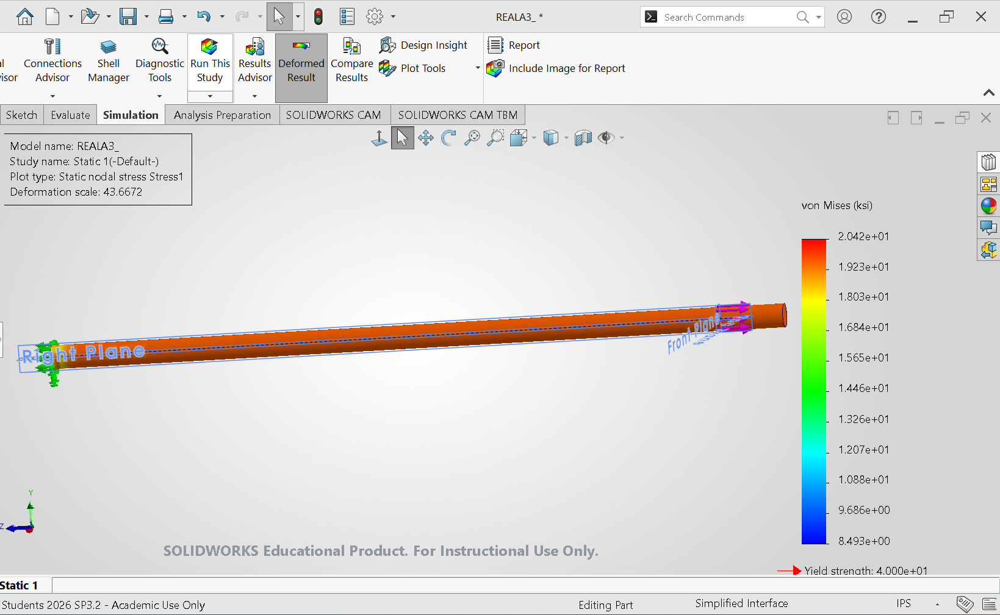
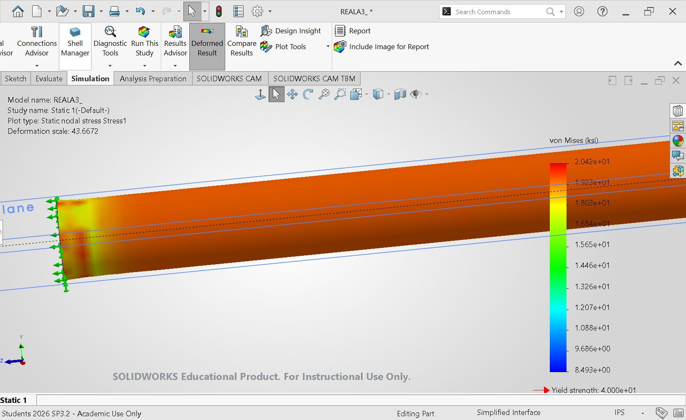
The Von Mises Stress graph above shows a very homogeneous stress pattern within the mid-span of the bar's structure. The maximum localized stress is 20.42 ksi at the fixed constraint due to multi-axial shear effects. This graph shows the bar’s maximum stress value is well below the yield strength of the material, which is 40.0 ksi.

#### FOS Map
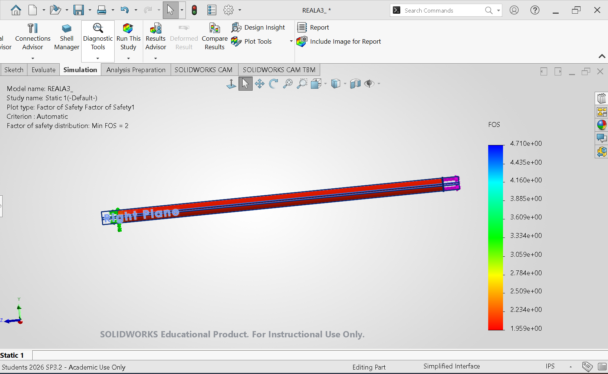
The Factor of Safety (FOS) graph shows the strength of the bar through the tensile stress, based on its material yield strength of 40.0 ksi. There exists a large homogeneous area (red area) along the body of the bar. The text caption on the graph states that there is a minimum factor of safety of 2, showing a sufficient safety margin even when under load.

### Percent Error Values

#### Percent Error of Deflection 
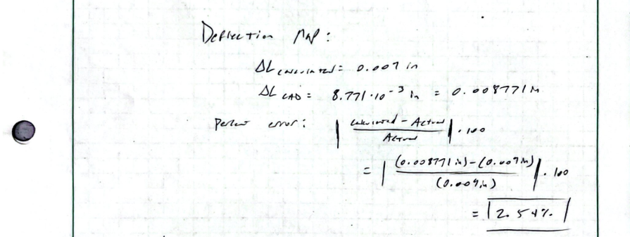
Using the axial deflection calculation of the Machinery’s Handbook, the formula gave a value of 0.009 inches. Analysis of the FEA gave the longitudinal displacement plot (UZ), which was very similar to that of the simulation, giving a value of 0.008771 inches. The percent difference between these two values is an error of 2.54%. 

The major contributors to the percent error can be from assumptions made during the hand calculation. The machinery handbook formula is an idealization that assumes that there is only axial deformation of the bar without any lateral distortion or constraints. This differs from the SolidWorks FEA model, which includes 3D solid elements that have Poisson's ratio. 

When the bar is stretched under the force/load of 300 lbf, it experiences lateral contraction. Due to the rigid fixed-geometry boundary condition in the model, there is a restriction on lateral contraction, which causes a stiffening effect and reduced deflection. For this specific design, I believe more in the SolidWorks FEA solution than the hand calculation. The elongation equation assumes that the bar is weightless, while the FEA model considers reality.

#### Percent Error of Allowable Axial Stress
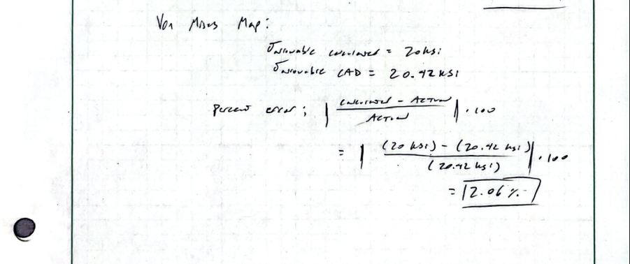
The hand-calculated allowable tensile stress with respect to the 300 lbs of load results in 20 ksi, and the allowable Von Mises stress calculated (CAD) from the SolidWorks FEA software results in 20.42 ksi. The comparison between these two parameters gives us an error of 2.10%. The error shows the close values of the elongation formula to the 3D solid elements due to the solid bar being more accurately used with the elongation formula.

#### Percent Error of FOS Map
!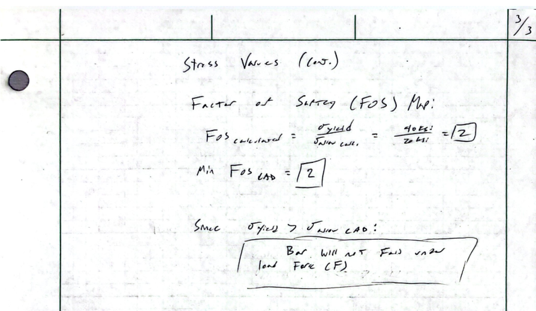
As seen in the picture above, both the calculated FOS value and the CAD FOS value are the same; there is no percentage error here.

It is also seen that the bar design will not fail under the load force (F).

## Pinhole
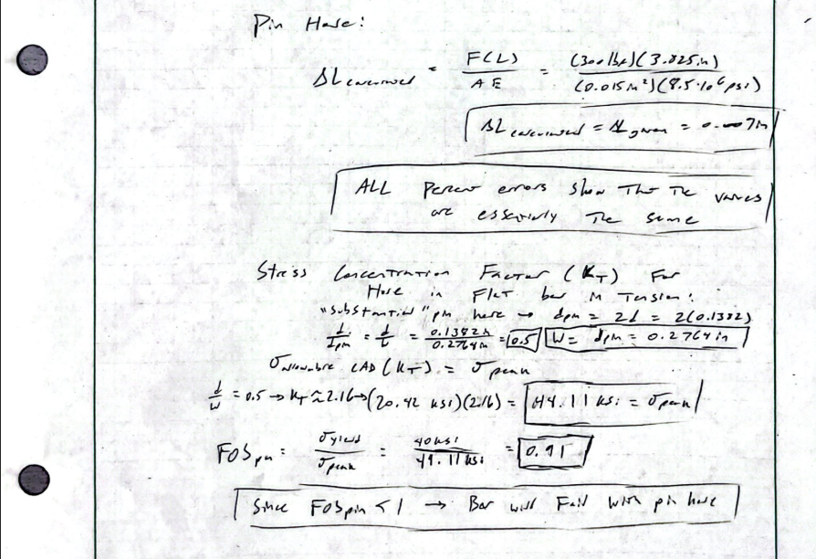

In order to determine the state of the pinhole without having to run the simulation again, we need to use the theoretical stress concentration factor K(t) of approximately 2.16 from Peterson's Charts and Machinery's Handbook to consider the geometric discontinuity. 

This can be seen in the work above; the "substantial" size listed in the assignment will be assumed to be a hole twice the diameter of the bar. Using Peterson's Charts and solving for the ratio of the diameter of the bar to the diameter of the pin, we use this ratio to get the stress concentration factor K(t).

In order to calculate the peak localized stress due to the pinhole, you would multiply the theoretical stress concentration factor (K(t)) by the FEA allowable stress (20.42 ksi), and the result would be 44.11 ksi. 

Comparing the peak stress to the 40.0 ksi yield strength of the aluminum, this indicates that the local safety factor would become 0.91. This new safety factor shows that the bar would deform permanently and would fail at the pinhole.

This analysis proved the significance of discontinuities in mechanical design. From the initial allowable stress, there is an increase in local stress as a result of the stress concentration caused by the hole.

## Lessons Learned/Mistakes

Lessons learned from this project are how to use and design a dynamic/parametric 3D CAD model by connecting geometric dimensions with the direct tension elongation equations from Machinery's Handbook using SolidWorks Equation Manager. It shows that an optimized geometry of the bar provides a realistic engineering base case (FOS = 2). But this also decreases the structural volume of the design and makes the material highly sensitive to yield failure when geometric discontinuities, such as pinholes included.

### Mistakes of First Design

#### Displacement Map
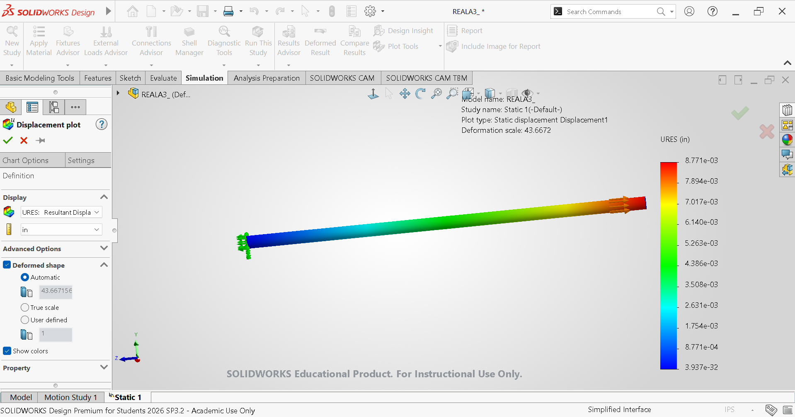
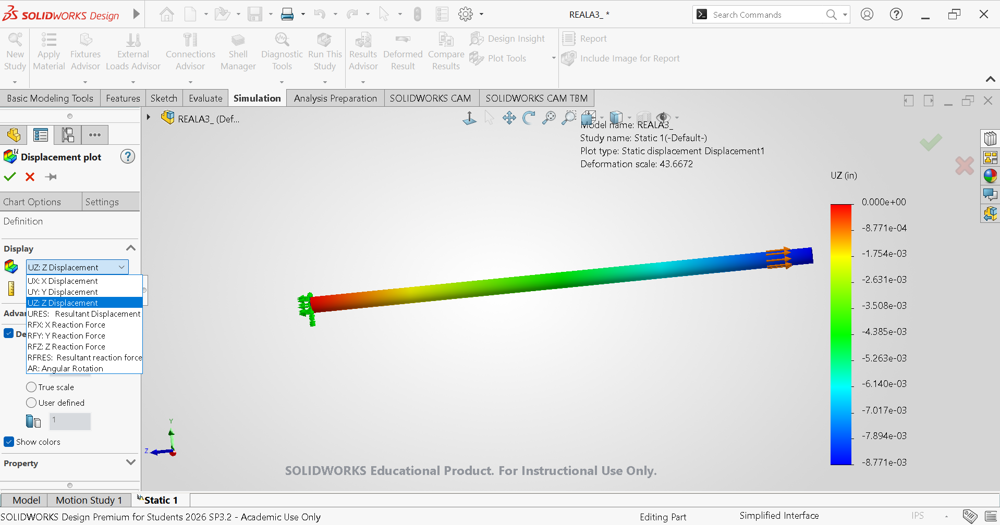

During the FEA, the displacement map revealed that the total resultant displacement (URES) had skewed values that were not consistent with hand calculations. It was necessary to change the plot definition properties to plot the displacement in the longitudinal Z direction (UZ) in the English IPS unit system. This helped to filter out all the multi-axial distortions. This allowed us to see a connection between the tensile elongation and the target parameter.

#### FOS Map
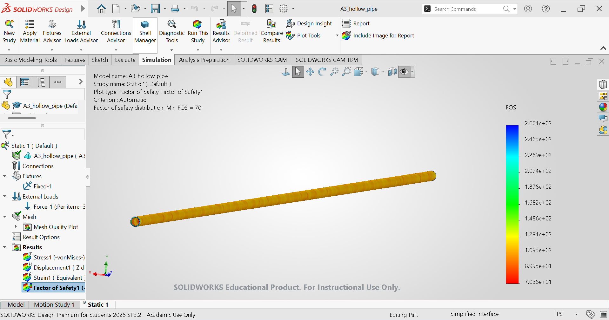

My first design iteration featured a hollow cylindrical structure with an outer diameter of 2.0 inches and a wall thickness of 0.125 inches; this allowed a very large length value of 187.76 inches due to the large values of the parametric equations. The strong structural geometry had very small internal tensile stresses when under 300 lbf, which resulted in a very high minimum Factor of Safety value of 70.4.

#### Calculated Values of First Design
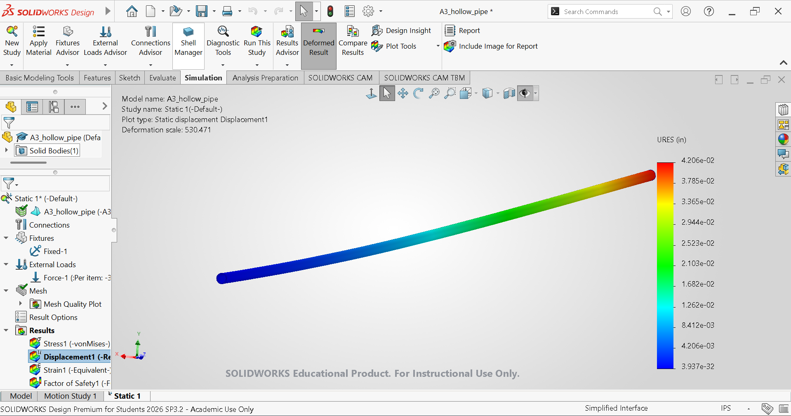

Within my first design, when examining the resultant total displacement map (URES), the information was off. My best guess was that the large length of 187.76 inches caused a gravitational sagging effect, which shows that real-life 3D structures experience gravitational effects that are not included in the elongation equation used.

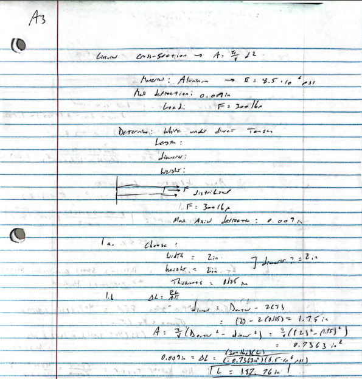

My calculated values for my first design prove that the length of my first design of the bar is 187.86 inches. While the math was correct and met the requirements for the assignment, I did not like that the FOS is very high due to the bar being too strong. I wanted to reduce the scale to achieve a realistic FOS value.

## Files

[CAD](REALA3_.zip)

[Work](A3_work.pdf)
## Communicate
Total Time: 7 hours
