A5 – [Bracket Design]

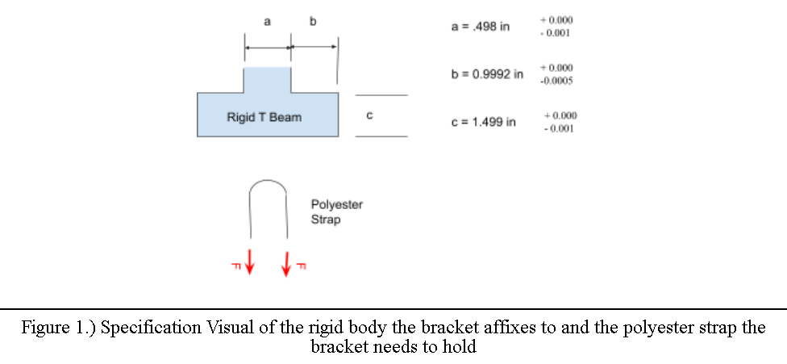
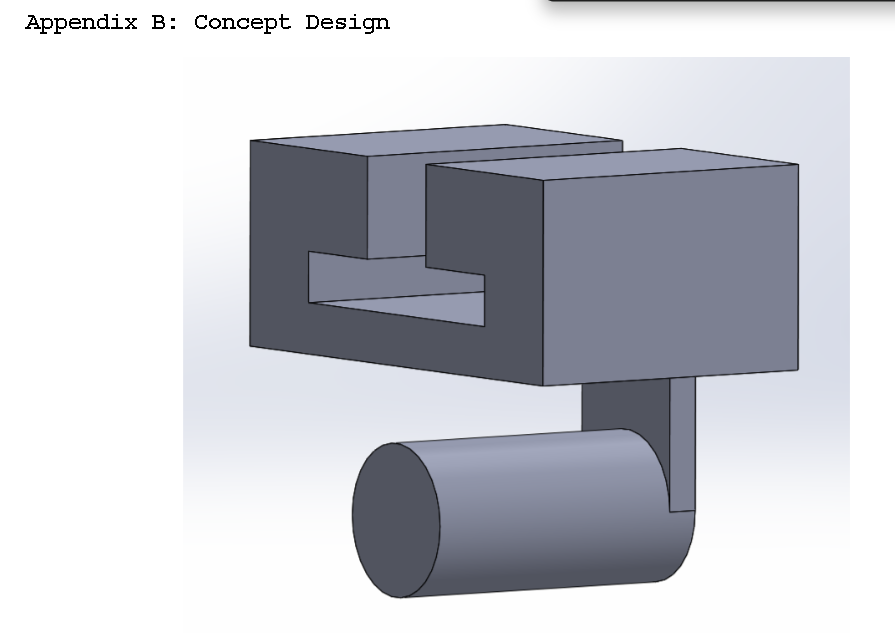

## Objective
The aim of this project is to develop a detailed design of a symmetric structural bracket to be used to support a symmetric load of between 500 lbf and 800 lbf using a safety factor of 4 with aluminum 6061-T6, Steel (ASTM A36), or Titanium (Ti-6Al-V4). The Uline Strap holds this load: Heavy Duty Polyester Cord Strapping - 3⁄4" x 2,500'. This support will be designed from the rigid T-Beam as shown in Figure 1. The bracket will be designed by reviewing both fundamental knowledge of stress and stiffness analysis based on particular classes of fit ("a", "b", and "c"), as well as a deflection limit of 0.005 inches. The stress and stiffness analysis will then be compared to determine the governing dimension. Finally, the designed dimensions will be verified using FBDs and calculations to produce a set of three-view drawings of the designed bracket.

## Assumptions
1. Homogeneous Material: The chosen metal is considered to exhibit the same material behavior at all points of the structure.

2. Isotropic Properties: The mechanical properties, such as the Yield Strength and the Modulus of Elasticity (E) of the structure, are totally independent of the direction.

3. Symmetric Features for Global Force Distribution: The features of the bracket are taken to be symmetric, so that the force is evenly distributed.

4. Uniform Structural Thickness: The thickness of all the rectangular features protruding into the paper is constrained to be uniform at 1.0 inch.

5. Idealized Connections/ Stress Concentration: The interfaces of the various features are considered ideal connections. The geometric discontinuities and sharp internal corners of each feature are neglected;

6. Dead Weight (Gravity) is Negligible: The structural dead weight of the aluminum structure is not considered since its value is entirely negligible compared to the selected mechanical load.

7. No Shear Stress Failure: The failure of the structure is considered only due to flexural and axial stresses.

### Selected Values
Material Selection: Aluminum 6061-T6 is the best material selected after considering both the structural characteristics and economic considerations.

Load Selection: The criteria for this project allowed a varying applied load between 500lbf and 800lbf. To set up a conservative structural design, the value of 500lbf is used as the initial value. By using the lowest limit of a certain applied force range, we can set up the lowest thickness of the material needed to keep a factor of safety of 4.

Symmetric Depth (z-axis): Using symmetry to make the design process gave us a starting point to consider a constant depth parameter. By setting up the global depth parameter of all the full rectangle objects as 1.0 inch along the z-axis, we get symmetrical objects.

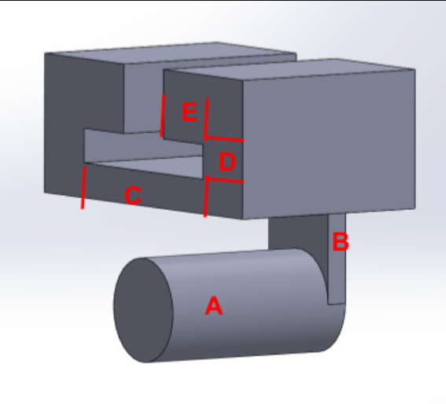

## Feature A (Stress)

### Knowns and Unknowns

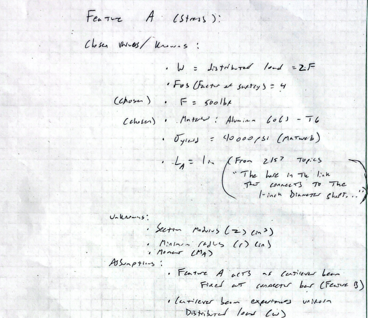

Here, represents the knowns and unknowns of feature A. It is assumed that feature A acts as a cantilever beam with an evenly distributed load W (2F). We need to solve for the section modulus (Z), radius (r), and moment (Ma)

Material properties (yield stress) are taken from Matweb for Aluminum 6061-T6 [Matweb](https://www.matweb.com/search/datasheet.aspx?matguid=1b8c06d0ca7c456694c7777d9e10be5b&ckck=1)

### FBD

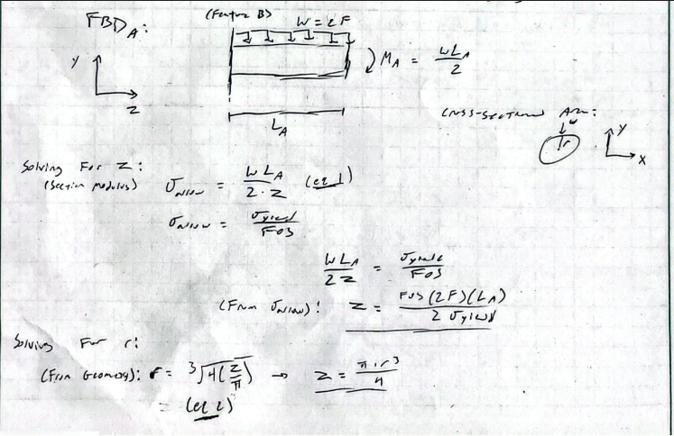
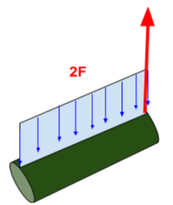

As seen in both pictures, feature A  is a fixed cantilever beam with an evenly distributed load (W). The fixed end resembles the connection to feature B; this is assumed to be rigid due to the assumptions listed. Feature A experiences a moment (Ma) due to W. 

#### Using allowable stress:
Solving for the section modulus (Z) through the governing equation from allowable stress seen in (eq 1) and setting it equal to the normal equation of allowable stress.

After setting both equations equal to each other, we eliminate allowable stress and can now solve for the section modulus (Z)

Using the governing equation for radius (eq 2), we solve for Z and again eliminate section modulus (Z) to solve for radius (r)

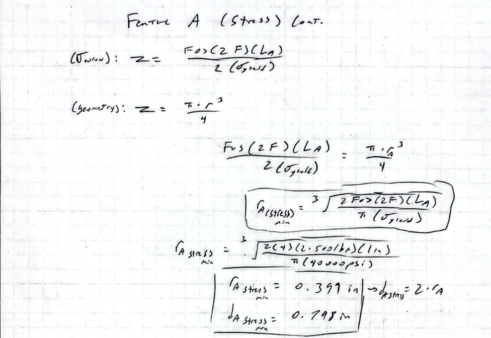

As seen in the picture above, both Z equations are listed; we set these equal to each other and can solve for r.

The first boxed equation resembles the algebraic expression for r in terms of stress analysis.

We then plug in the numeric values listed in the knowns and unknowns section to get a radius of 0.399 inches, or a diameter of 0.798 inches.

## Feature A (Stiffness)

### Knowns and Unknowns 

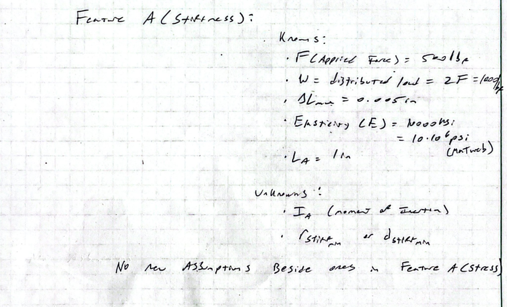

Above are the knowns and unknowns of the stiffness analysis. There are no new assumptions for this analysis besides the ones already listed in the stress analysis.

Material values such as Elastic modulus (E) are taken from [Matweb](https://www.matweb.com/search/datasheet.aspx?matguid=1b8c06d0ca7c456694c7777d9e10be5b&ckck=1)

We need to solve for the moment of inertia (Ia) and radius (r) based on the stiffness analysis.

### FBD

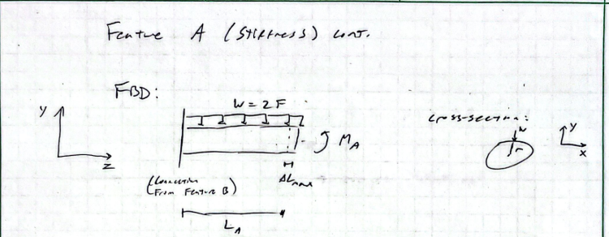

As seen above, the FBD is the same as the stress analysis, with a dashed line resembling the maximum deflection (deltaL); this was mentioned in the knowns and unknowns.

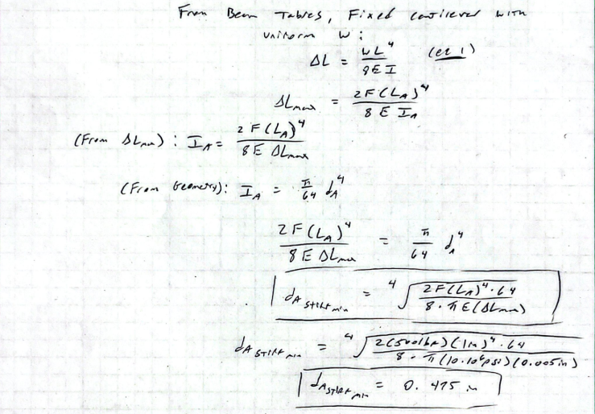

The governing equation for a fixed cantilever with a uniform W is shown (eq 1). We then put it in terms of our variables and solve for the moment of inertia (Ia)

Ia is also classified through the geometry of the cross section being a solid cylinder. 

We use both of these equations and set them equal to each other. 

The first boxed equation results in solving for the diameter from Ia and eq 1.

We then plug in our numerical values from the knowns and unknowns to get a diameter from the stiffness analysis of 0.475 inches.

### Determining Governing Equation

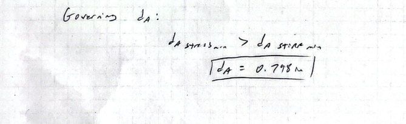

Because of the stress analysis, the diameter of 0.798 inches is greater than the stiffness-analysis diameter of 0.475 inches. The greater minimum diameter needed is from the stress analysis.

## Feature B (Stress)

### Knowns and Unknowns

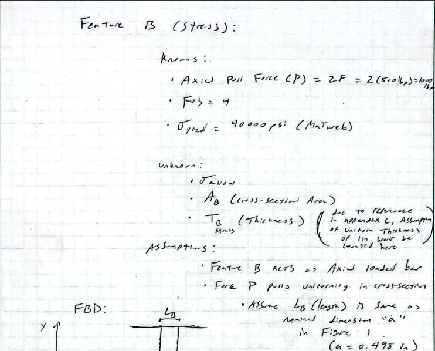

As seen in the picture above, the knowns of feature B are tensile force (P = 2F)  from feature A, an FOS of 4, and a yield stress of 40000 psi from [Matweb](https://www.matweb.com/search/datasheet.aspx?matguid=1b8c06d0ca7c456694c7777d9e10be5b&ckck=1)

We need to solve for allowable stress and thickness (TB)

As for the assumptions, as seen in Appendix C, Feature B will operate as a connector that is local in nature and not a full-width structural member since its thickness should not be dependent on the overall 1-inch depth of the bracket structure. From Appendix C, it can be noticed that Feature B has to be much thinner so as to create enough space on either side of the cylinder pin in Feature A. Should Feature B have been made with a depth of 1 inch, it would completely block the window space under the bracket for the polyester strap to pass over and center on the support cylinder.

Feature B is noted to act as an axially loaded bar which force P is a tensile load. Where force P pulls uniformly in the cross-section

Feature B’s length (LB) is noted as the nominal dimension “a” in Figure 1 due to Feature B being mounted just below the cutout slot of the T-beam interface. Since the length of the horizontal slot of the internal cutout slot is dependent on the nominal rail size “a” = 0.498 inches, making sure that Feature B is the exact same length as the above mentioned size makes sure that the downward force exerted by the strap moves along the centerline vertical direction. Otherwise, any deviation in the length or alignment of the feature will create a horizontal offset, causing moment and twist in the upper bracket blocks.

### FBD

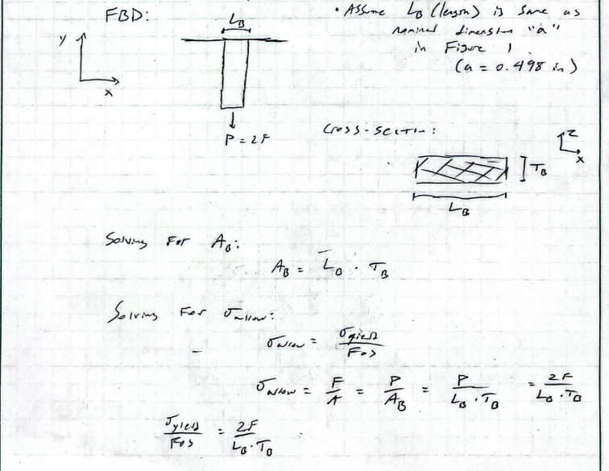

As seen in the picture above, the FBD is as stated: an axial bar with a tensile load (from feature A) pulling downward. 

Solving for the cross-sectional area (AB) is shown from the cross-section.

Solving for allowable stress is shown below AB using the same equation used before. The second equation is the governing axial-loaded stress formula. 

Setting both allowable stress equations equal to each other and using the expanded cross-sectional area allows us to solve for TB.

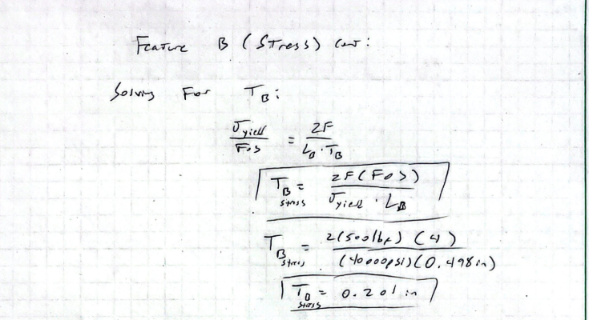

Solving for TB based on stress gives us the first boxed equation.

Putting the numerical values from the algebraic solution gives us a thickness from the stress analysis of 0.201 inches.

## Feature 2 (Stiffness)

### Knowns and Unknowns 

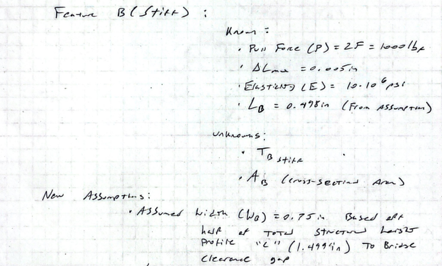

These knowns and unknowns are no different from those previously stated.

New Assumptions:
The chosen 0.75-inch vertical dimension represents an engineering compromise to provide sufficient clearance between the lower bracket floor plate (Feature C) and the cylinder that will be attached through the strap mount (Feature A). Given that the bracket's internal vertical height is determined by the railroad rail nominal dimension "c" = 1.499 inches, it is logical to choose the height of Feature B as approximately half of it, thus ensuring a balanced 1:2 ratio of the geometrical dimensions. The chosen vertical distance ensures sufficient clearance for the polyester strap to be able to loop around the cylinder pin without touching the upper body of the bracket.

### FBD

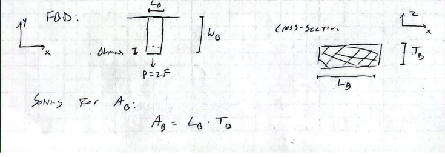

As seen in the FBD, Feature B is only experiencing the tensile force noted in the stress analysis.

Solving for AB is the same as before.

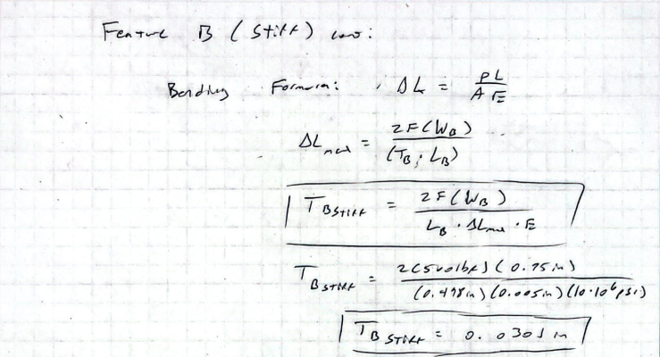

This shows the governing Bending Formula; putting in terms of the values we use and solving for TB, we get the algebraic expression in the first boxed equation.

Plugging in the values needed into the algebraic expression, we get a thickness (TB) from the stiffness analysis of 0.0301 inches. 

### Determining Governing Equation

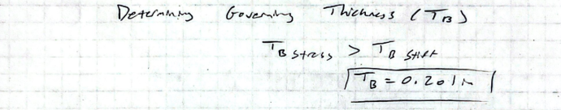

Determining the governing TB, we see that the stress analysis (0.201 inches) is greater than the stiffness analysis (0.0301 inches). Using the same reasoning as from Feature A, the governing thickness is from the stress analysis.

## Feature C (Stress)

### Knowns and Unknowns 

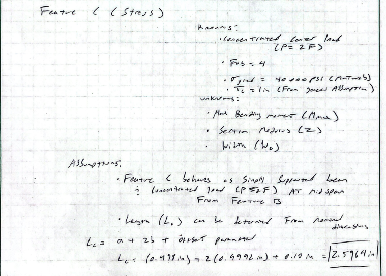

As seen in the picture above, the knowns and unknowns include a load force (P = 2F), the same FOS of 4, the yield stress from MatWeb of 40000 psi, and the symmetric assumption for the thickness of features of 1 inch.

As for unknowns, we need to solve for the width (WC), moment (Mmax), and section modulus (Z)

Assumptions:
Feature C behaves as a simply supported beam with the concentrated load (P) at the midspan (from feature B).

The total span length of feature C (LC) will be expressed by the equation LC = (a + 2b + 0.10 inches) for the horizontal channel to bridge the flange width "a" (Figure 1) and the running fit b (Figure 1) of the mating T-beam rail. The offset of 0.10 inch is used as an important clearance margin to allow the bracket to operate without interfering with the rail by preventing the bracket from jamming into the rail. The reason for choosing this value is the reasonable tolerance of the dimensions of each feature so far, as well as to minimize the mechanical play of the bracket.

Solving for LC gives a value of 2.5964 inches.

### FBD

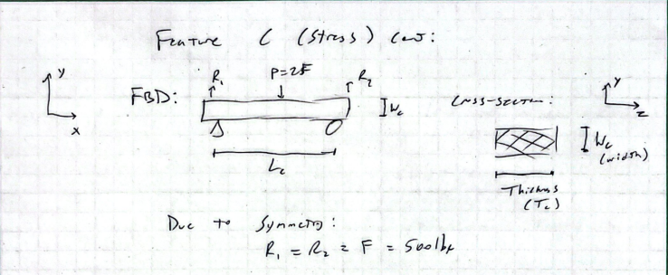

As seen in the FBD, feature C is treated as a simply supported beam with load P at the midspan, with the resulting forces (R1 and R2) due to symmetry, both reaction forces equal to 500lbf.

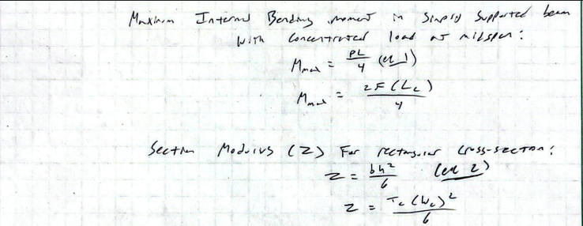

Solving for the moment due to the governing equation for this simply supported beam (eq 1) and putting it in terms of our variables.

Right underneath the moment formula, we solve for the section modulus (Z), based on the cross-sectional area of Feature C from the FBD (eq 2). We now put our variables into eq 2.

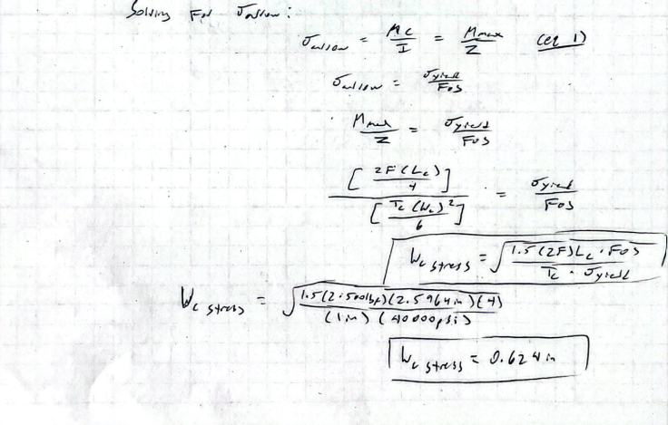

Solving for allowable stress from the equivalent equations (eq 1), we can get allowable stress in terms of Z and moment. 

We then have the same formula for allowable stress that we have used before, and we set both equations equal to each other, eliminating allowable stress.

Expanding both moment and Z, we can then solve for width WC, with the first blocked algebraic equation showing this.

Plugging in our numerical values from the knowns and unknowns, we get WC based on stress analysis being 0.624 inches.

## Feature C (Stiffness)

### Knowns and Unknowns 

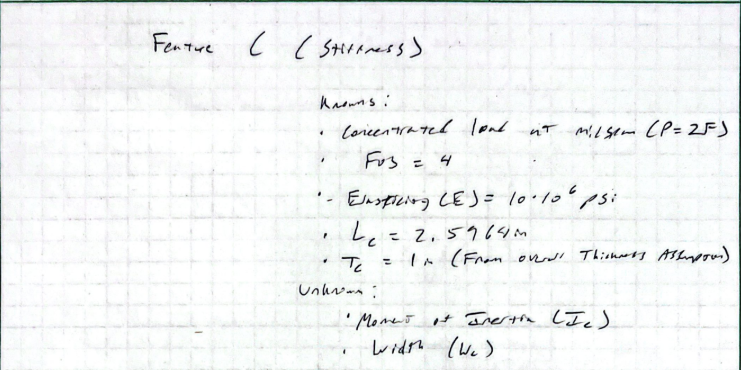

As listed above, the knowns and unknowns do not change from the stress analysis besides what we need to find.

As for unknowns, we need to find the moment of inertia (IC) and width (WC)

There are no new assumptions.

### FBD

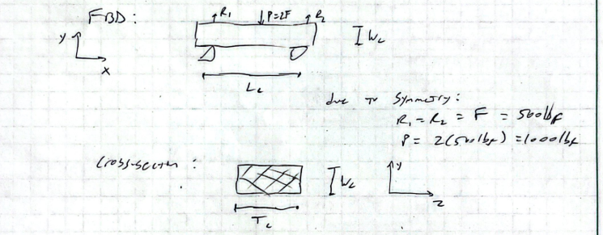

As seen above, the FBD does not change from the stress analysis. 

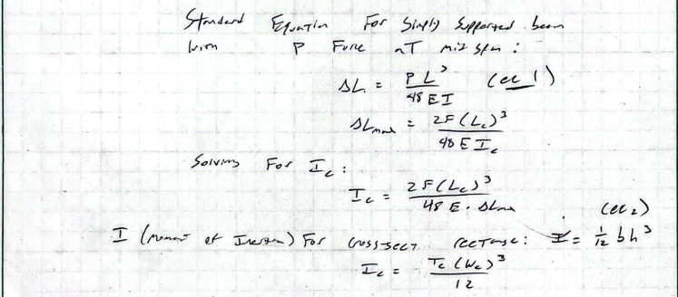

Shown above, the standard equation for a simply supported beam with a concentrated load P at the midspan is shown in eq 1.

Putting eq 1 in terms of our variables and solving for the moment of inertia (IC) is shown.

Due to the cross-section of Feature C, the geometric formula for the IC is shown in eq 2.

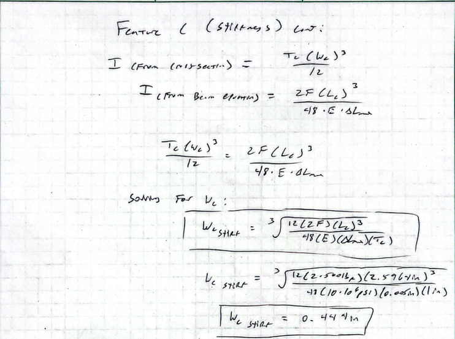

Putting both of these formulas equal to each other, we eliminate IC, and we can then solve for WC.

This algebraic expression solving for WC based on the stiffness analysis can be seen in the first boxed expression.

Plugging in our numerical values, we get WC based on stiffness as 0.444 inches.

### Determining Governing Equation

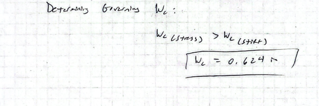

Determining the governing WC is shown above.

The same logic is used as before: WC stress (0.624 inches) is greater than WC stiffness (0.444 inches); therefore, WC is 0.624 inches

## Feature D (Stress)

### Knowns and Unknowns 

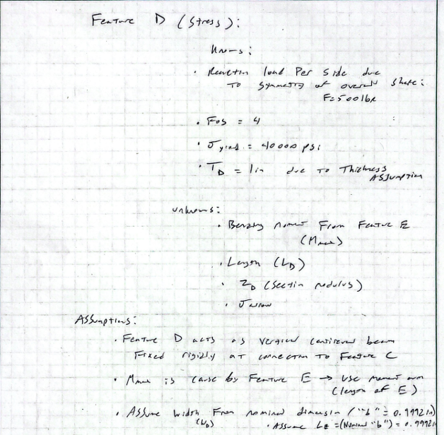

Due to our assumed symmetric design along the y-axis, we now have the force applied to one side of Feature D being F. We still have the FOS of 4, the yield stress based on Matweb (40000 psi), and our other assumed depth of 1 inch.

Unknowns include the moment from Feature E; this is included due to the overall design, as seen in Appendix B. Feature E is connected to Feature D, and Feature E experiences a load F pulling downward. This allows us to assume Feature D acts as a vertical cantilever beam.

Other unknowns include the length (LD), section modulus (ZD), and allowable stress.

As for the assumptions stated earlier, Feature D acts as a vertical cantilever beam with a moment from Feature E, and the width (WD) is the nominal dimension (from Figure 1) of “b” (0.9992 inches).

Feature D's width (WD) can be calculated using the nominal value of "b" (0.9992 inches) since the vertical sides need to have the exact geometry clearances to meet the mating T-beam rail body. The height profile is set equal to the running fit of the rail, which gives us a perfect 1:1 proportion square clearance window (which will be seen in the later CAD design). This design optimizes by removing excess dead weight and effectively shortening the lever arm to maximize the rigidity against horizontal deflection from Feature E. 

### FBD

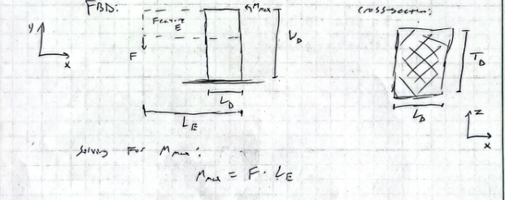

As seen in the FBD of Feature D, the outline of Feature E is shown alongside the force Feature E experiences. This causes a moment on Feature D. 

Solving for the moment (Mmax) is shown below the FBD. 

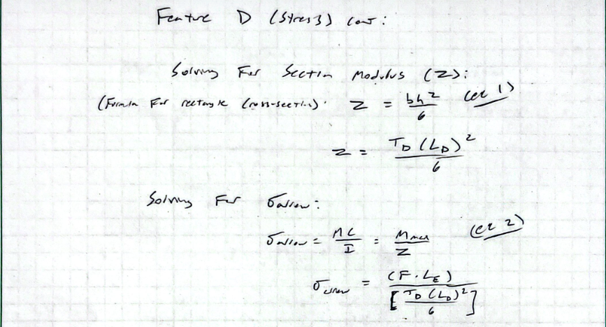

As seen above, using the governing equation for section modulus (Z) from the cross-section is seen in eq 1. Putting eq 1 in terms of our variables is shown beneath eq 1. 

Solving for allowable stress by equating the formulas to get allowable stress containing terms of Z is shown in eq 2. 

We then expand the values of moment and Z that we solved for to get the term LD inside the equation.

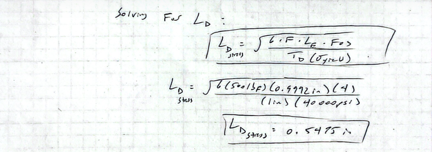

Using the extended eq 2, we can solve for LD. The algebraic expression is shown in the first boxed expression.

Plugging in our numerical values from the knowns, we solve for LD from the stress analysis, which is 0.5475 inches. 

## Feature D (Stiffness)

### Knowns and Unknowns 

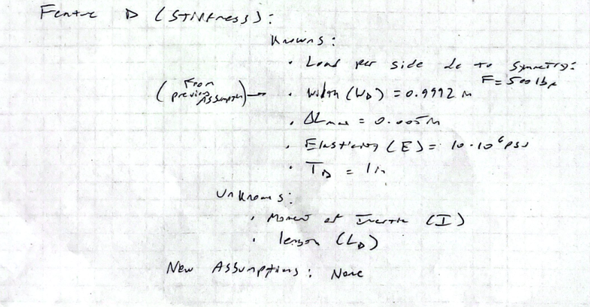

There are no new additions to the knowns besides the addition of Elasticity and width WD based on our previous assumption.

As for unknowns, we need to solve for the moment of inertia (I) and length (LD)

No new assumptions were made.

### FBD

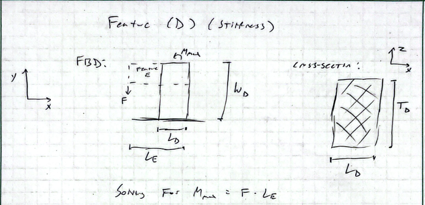

As seen in the FBD above, it is the same as the one we described in the stress analysis. We also solve the moment from Feature E, as seen below (as we did with the stress analysis)

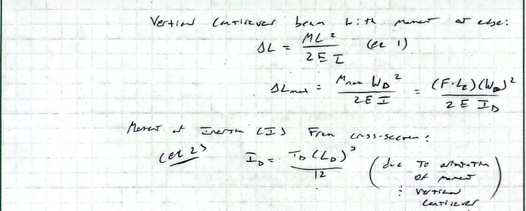

The formula for a vertical cantilever beam with a moment applied at the free end can be seen in eq 1.

Plugging our variables into eq 1 is shown below. 

Solving for the moment of inertia (I) based on the geometry of the cross-section seen in the FBD, we get the expression eq 2.

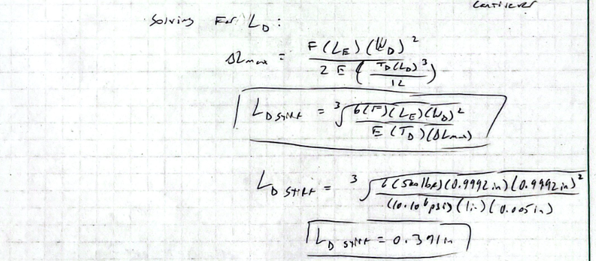

Plugging in our geometric formula for I into eq 1, we get the variable LD. Solving for LD can be seen in the first boxed expression.

Plugging in our numerical values from the knowns, we get LD from stiffness analysis as 0.391 inches.

### Determining Governing Equation

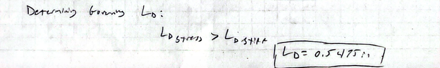

Due to the same logic as previous features, LD from stress analysis (0.5475 inches) is greater than LD from stiffness analysis (0.391 inches). Therefore, LD is 0.5475 inches.

## Feature E (Stress)

### Knowns and Unknowns

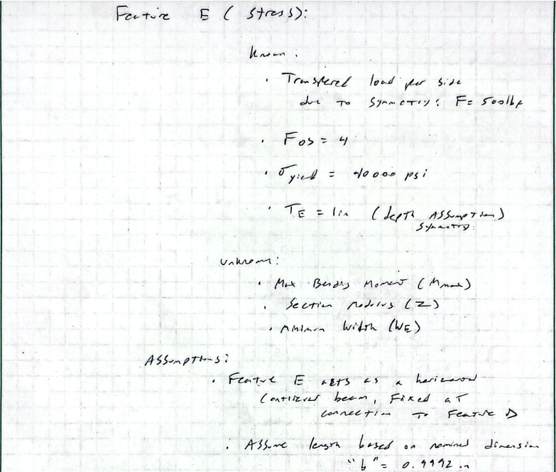

Knowns include the same logic of symmetry, with the load F being applied perfectly on each side. There will still be the same FOS of 4, the yield stress value from Matweb (40000 psi), assumed symmetric depth of 1 inch.

Unknown variables we need to solve include the moment (Mmax) from Feature E, section modulus (Z), and width (WE)

Assumptions include Feature E acting as a horizontal cantilever beam with force F acting downward on the free end.

The overhang length of Feature E (LE) is determined specifically by the dimension "b" (0.9992 inches), since the internal shelf width would need to fit the width of the flange on the rigid T-beam rail. The direct correspondence of the dimension of this feature to that of the rail will create the area that will provide mechanical connection and allow the transfer of the reaction clamping force of the bracket. From an engineering perspective, the use of this dimension will ensure that there is total surface contact with the rigid rail.

### FBD

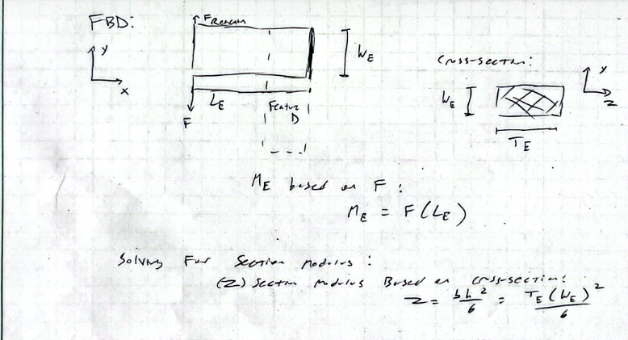

As seen above, the FBD of Feature E behaves as a horizontal cantilever with load F on the free end. The outlined figure resembles Feature D, and as stated in the beginning assumptions, all connections for all features are to be seen as rigid. 

The reaction load due to static equilibrium will be equal to the applied load F.

Solving for the moment of Feature E is shown below.

Solving for the section modulus (Z) based on the cross-section is also shown underneath the moment calculation. Z is based on the cross-sectional area

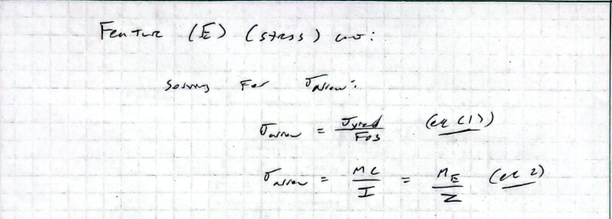

Solving for allowable stress based on the generic formula is shown in eq 1.
Solving for allowable stress based on the moment and section modulus can be seen in eq 2.

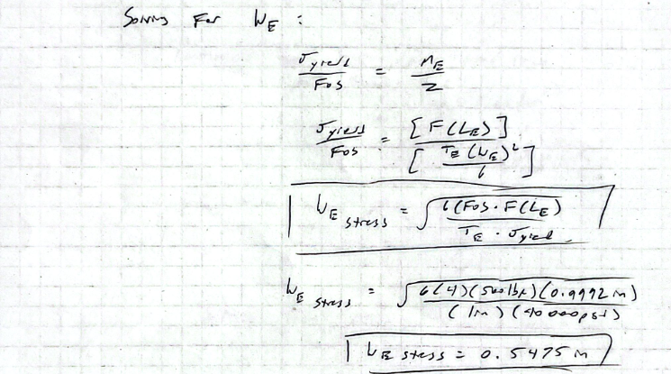

Solving for width (WE) can be seen by putting eq 1 and eq 2 equal to each other and expanding the moment and Z.

This allows us to solve for WE. Solving for WE leads to the algebraic expression shown in the first boxed expression.

Plugging in our numeric values from the knowns, we get WE based on the stress analysis to be 0.5475 inches.

## Feature E (Stiffness)

### Knowns and Unknowns

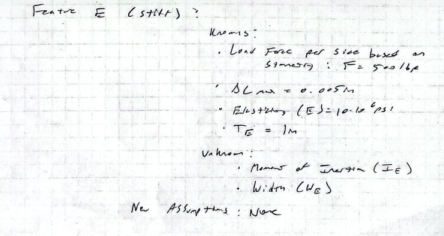

As seen above, no new knowns were added, besides the material elasticity (10*10^6 psi) from Matweb.

Unknown values we need to solve for include the moment of inertia (IE) and width (WE)

No new assumptions were made

### FBD

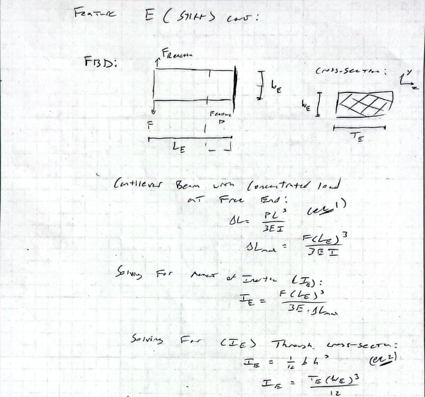

As seen above, the FBD is the same as the one from the stress analysis.

The governing equation for the horizontal cantilever beam with a concentrated load at the free end is shown in eq 1.

Plugging our variables into eq 1 is also shown.
Underneath eq 1, we also solved for the moment of inertia (IE) based on eq 1.

IE can also be solved from the cross-sectional geometry, which is also shown in eq 2.

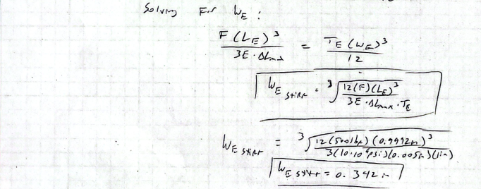

Putting both equations equal to each other eliminates IE and gives us the variable WE to solve for.

The algebraic expression for solving for WE can be seen in the first boxed expression

Plugging in our numeric values from the knowns and solving for WE, we get a value of 0.342 inches.

### Determining Governing Equation

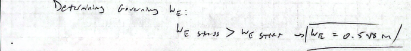

Based on the logic we used, WE based on stress analysis (0.548 inches) is larger than WE based on the stiffness analysis (0.342 inches); therefore, WE is 0.548 inches.

## Multiview Sketch (Stress)

Front View (below)

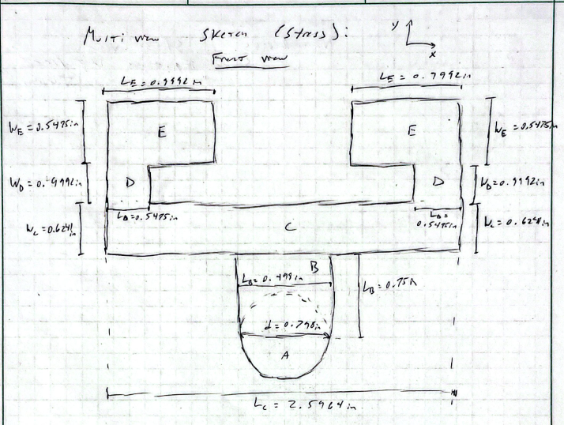

Right View (below)

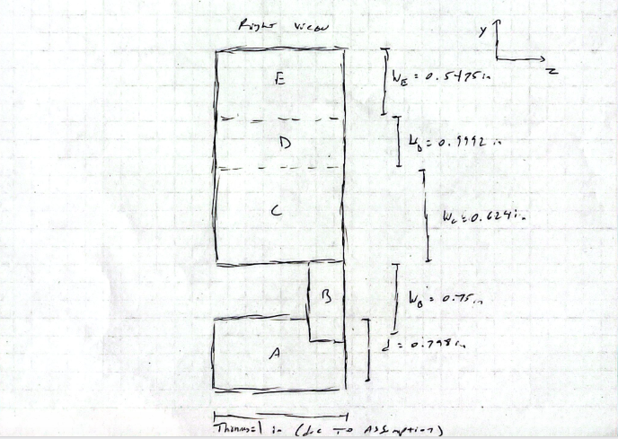

Top View (below)

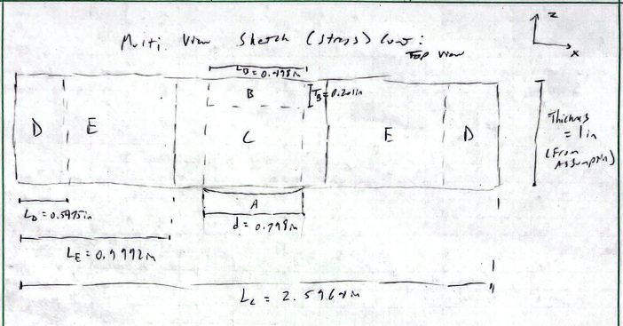

## Multiview Sketch (Stiffness)

Front View (below)

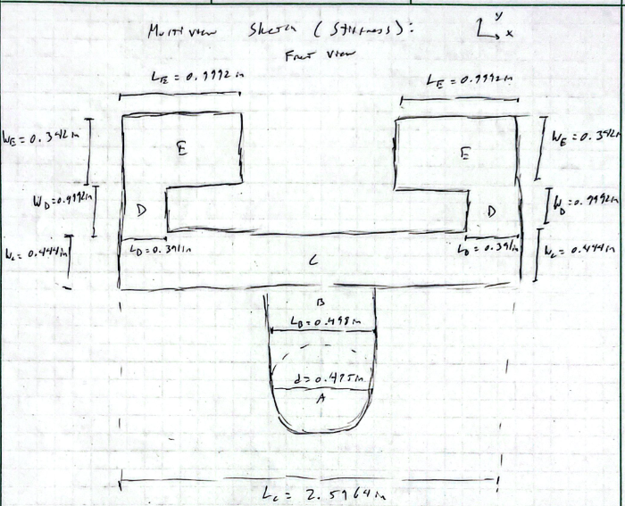

Right View (below)

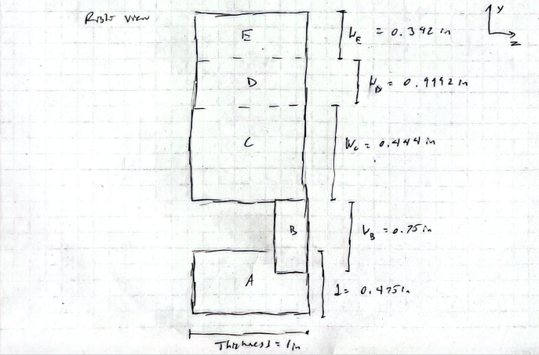

Top View (below)

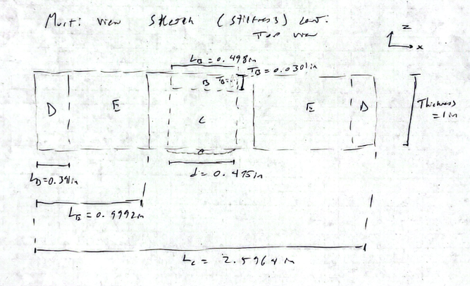

## Work
[Work](a5_work.pdf)

## Communicate
Time: 20 hours 
