# A6 – [Bracket Drawing (Drawings Part 1)]

## Objective

The goal of this engineering assignment is to create a full solid model and a multi-view engineering drawing of the designed bracket, including all necessary elements for ensuring its strength and stiffness under symmetric loading. Using the established governing dimensions from the given constraints, the full parametric solid model was created through the CAD program using embedded equations driving the important elements. The parametric assembly and the manufacturing drawings were created; the drawings were set up in the standard third-angle projection system with localized engineering tolerances for critical sliding-fit joints, along with the standard block tolerance system for other geometry. Then, a detailed technical reflection on the given questions.

## Corrections

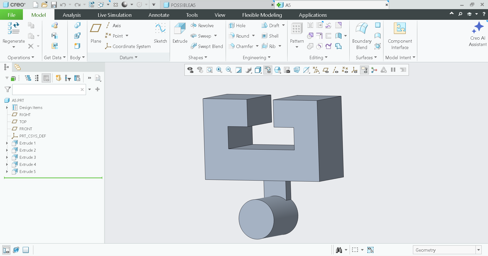
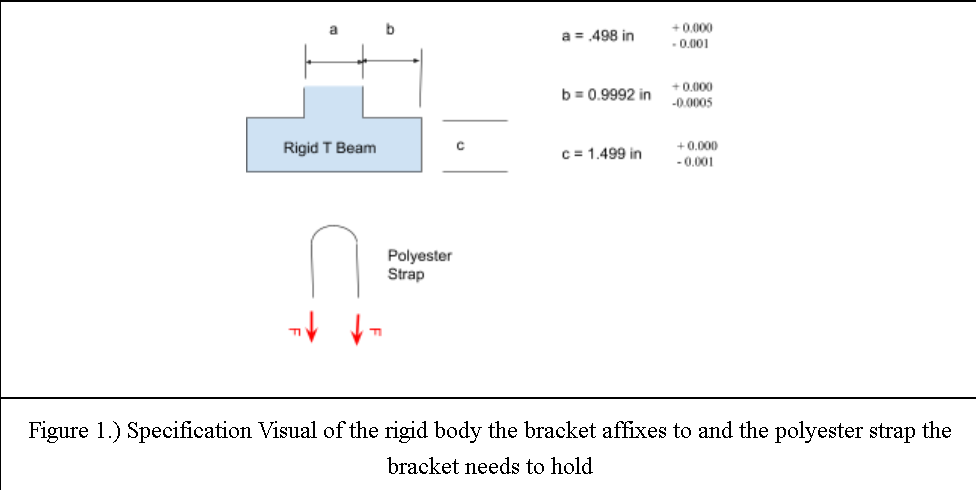

In my previous design, I did not account for the space each feature took up within the others, based on my FBD. 

As seen in the picture, the gap was measured and was too small for the rigid beam to pass through.

To fix this, I decided to make new assumptions and ensure the nominal dimensions in Figure 1 reflected the gap in my bracket. 

### New Feature B (Stress)
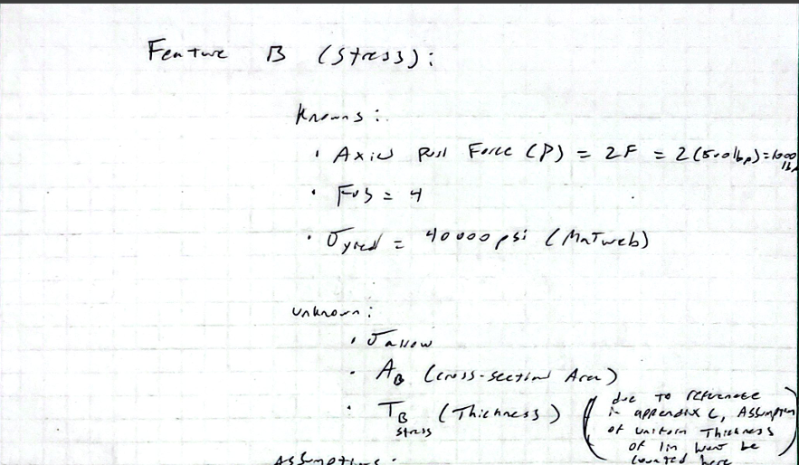
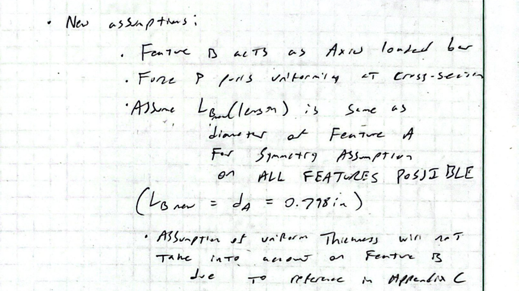

#### FBD
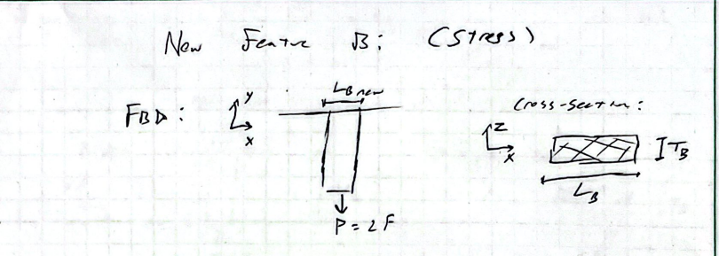
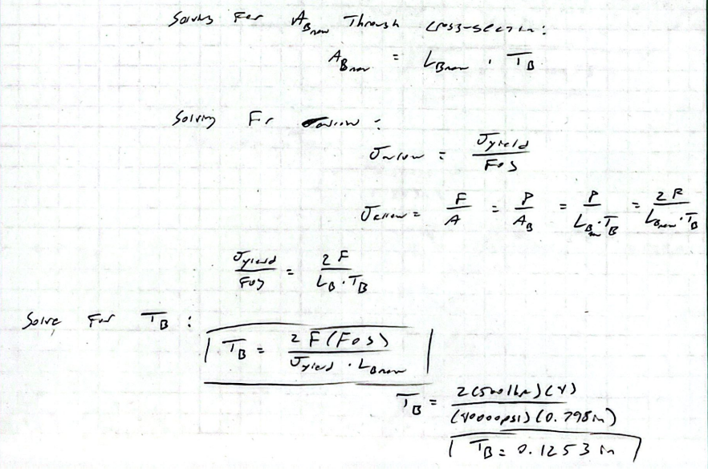

As seen above, the FBD remains the same.

We keep the assumption of the previous design for the length of Feature B (WB).

The same process of solving for the thickness (TB) remains. 

From the stress analysis, TB equals 0.1253 inches.

### New Feature B (Stiffness)

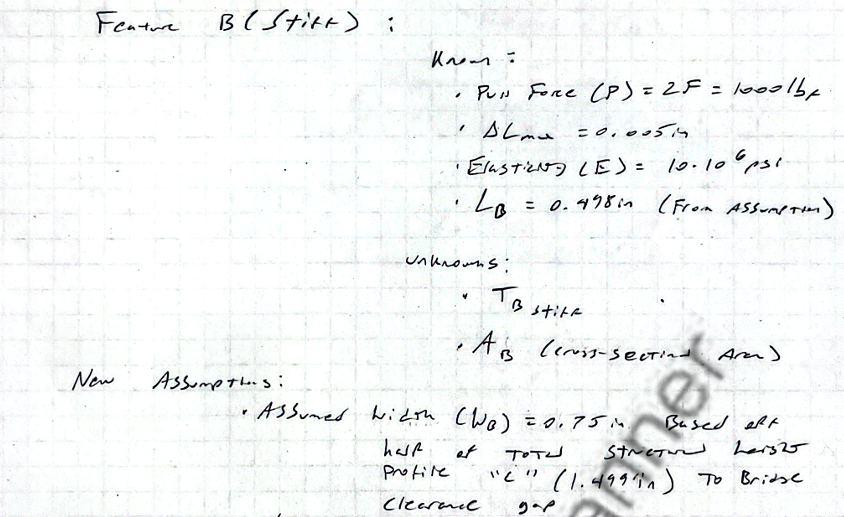
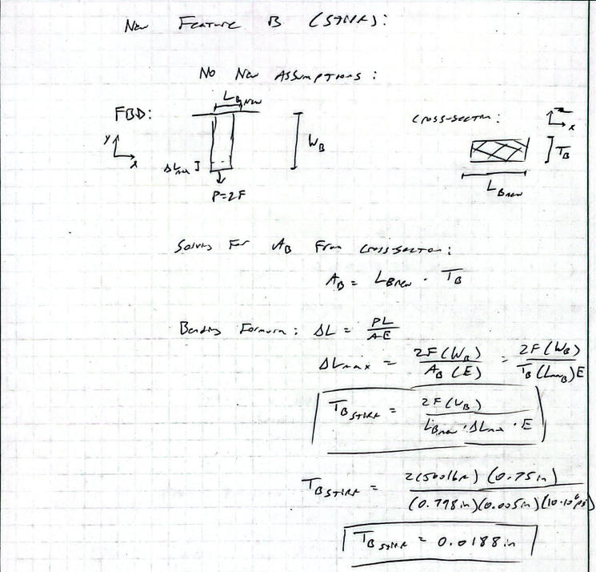

As seen above, no new assumptions have been made. 

From the stress analysis, the format for solving for TB remains the same as in the FBD.

TB based on the stiffness analysis equals 0.0188 inches.

### Governing TB

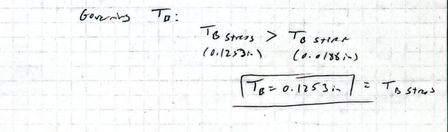

The logic in determining the governing TB remains unchanged, as seen above.

### New Feature C (Stress)

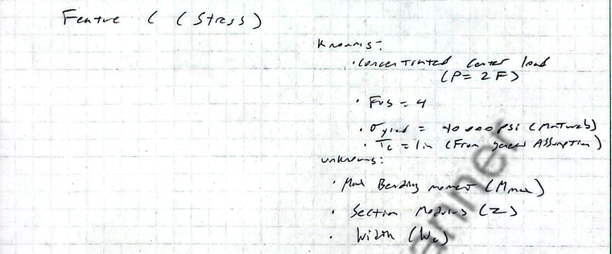
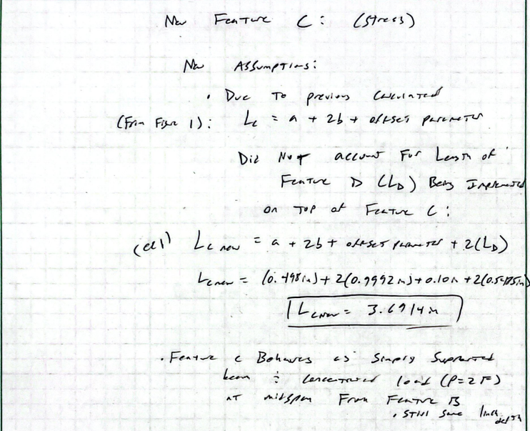
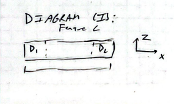

As seen above, new assumptions have been made for Feature C.

From the previous design, length (LC) was determined by the nominal dimensions, but did not take into account the lengths of both D Features (as seen in diagram i).

To account for the proper length (L_Cnew), we need to add to the nominal dimensions the offset parameter (0.10 inches), and twice the Feature D length. (eq 1)

#### FBD
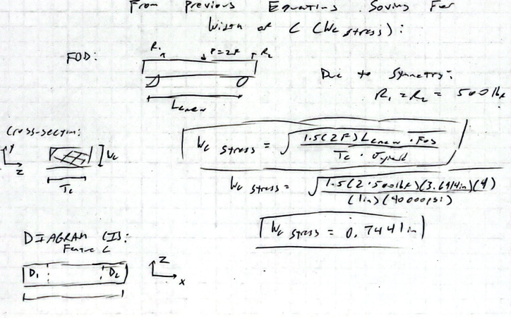

As seen above, solving for width (WC) remains the same. 

Using the same algebraic expression solved from the previous design, WC based on stress equals 0.7441 inches.

### New Feature C (Stiffness)
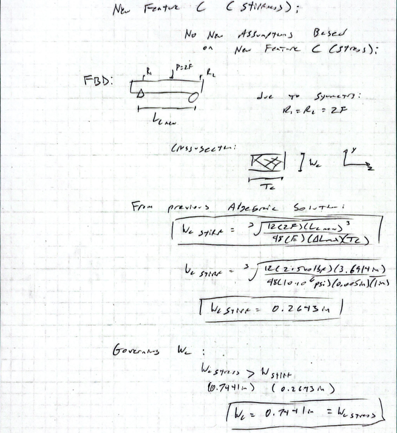

As seen above, no new assumptions were made besides the ones already listed from the new stress analysis.

Using the previous algebraic expression from the previous design for stiffness, WC based on stiffness equals 0.2643 inches.

The logic for determining the governing WC remains: WC based on stress governs the stiffness analysis.

### New Feature D (Stress)

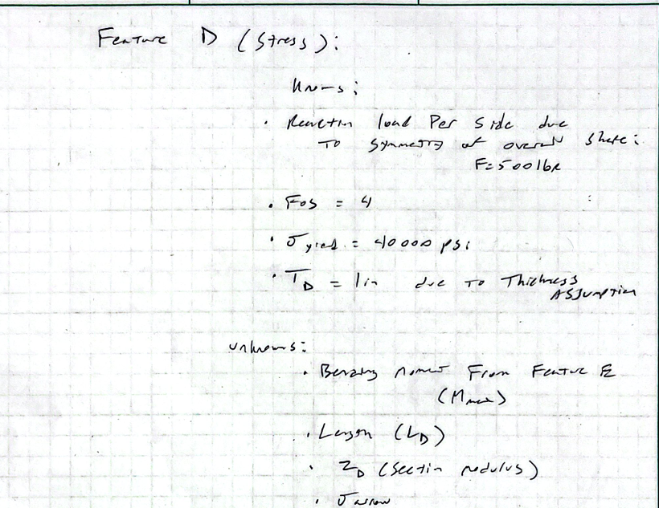
[a6_w14](a6_w14.png)

As seen above, new assumptions have been made.

From the previous design, we assumed Feature E had a width (WE) of 0.5475 inches. 

To determine the proper width of Feature D (WDnew), we need to account for the width of Feature E that is already taken up within Feature D, alongside the needed clearance gap of nominal dimension “c” (1.499 inches).

To do this, WDnew equals WE plus “c”; this equates to 2.0465 inches. 

#### FBD
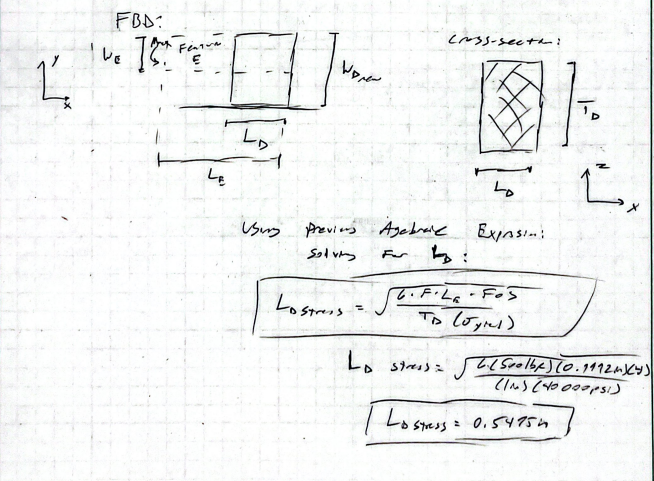

As seen above, the FBD has not changed, along with the format of solving for the length of Feature D (LD)

Using the previous algebraic expression from the last design, LD equals 0.5475 inches.

### New Feature D (Stiffness)

#### FBD
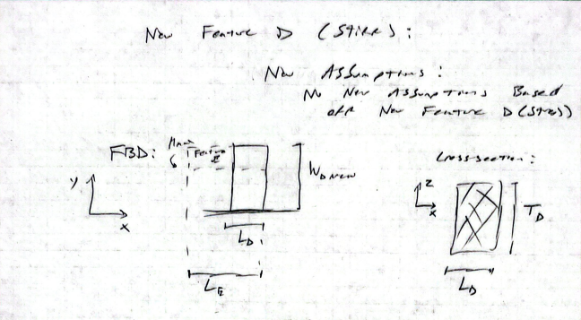

As seen above, the FBD has not changed either, and there are no new assumptions in the new stress analysis.

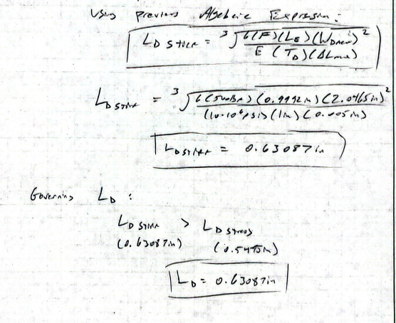

Using the same format to solve for LD based on stiffness, we use the same algebraic expression as the previous design. LD based on the stiffness analysis equals 0.63087 inches.

The logic of determining the governing LD stays the same: because LD based on stiffness is greater than LD based on stress, LD based on stiffness governs (LD equals 0.63087 inches).

## CAD

Feature A and Feature E will be kept due to the geometry assumptions connecting well with my other assumptions. 

### Stress Model vs Stiffness Model:

The modeling of the parametric properties based on the stress analysis equations provides the most reliable solution since the strength conditions dictated the majority of the part's dimensions relative to their stiffness values. The stress analysis equations and values are input into the global variables in the CAD modeling, and further FEA testing guarantees a safety factor of 4 for the part no matter what changes are made to the geometry later on. With this approach to modeling, it becomes clear that any automatic parametric changes will ensure that the maximum load conditions are satisfied first.

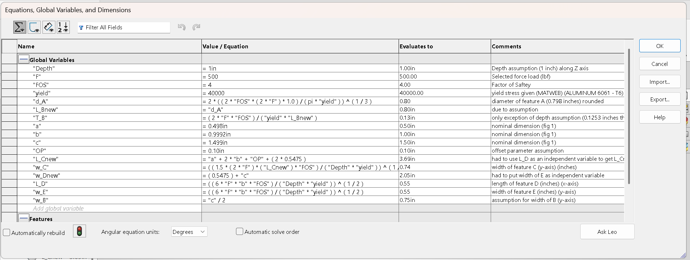

The above shows the parametric equations based on the stress analysis values alongside the expressions for the dependent variables. 

Independent variables:

1. Depth = 1 inch (assumption)
2. F = 500 lbf (chosen value)
3. FOS = 4 (given)
4. yield = 40000 (Matweb chosen from Aluminum 6061-T6)
5. a = 0.498 inches (from Figure 1)
6. b = 0.9992 inches (from Figure 1)
7. c = 1.499 inches (from Figure 1)
8. OP (offset parameter) = 0.10 inches (chosen)

Dependent Variables: (all rounded to 2 decimal places)

1. d_A = L_Bnew =  0.80 inches (diameter of Feature A)
2. T_B = 0.13 inches (thickness of Feature B
3. L_Cnew = 3.69 inches (length of Feature C)
4. w_C = 0.74 inches (width of Feature C)
5. w_Dnew = 2.05 inches (width of Feature D)
6. L_D = 0.55 inches (length of Feature D)
7. w_E = 0.55 inches (width of Feature E)
8. w_B = 0.75 inches (width of Feature B)

### Feature A
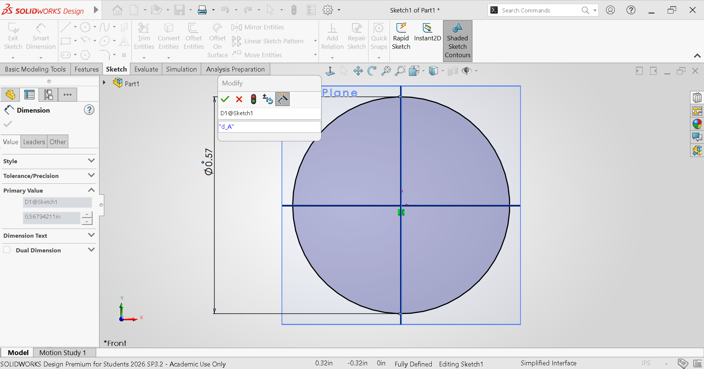

The above shows the parametric dependent variable, the diameter of Feature A (d_A), being used.

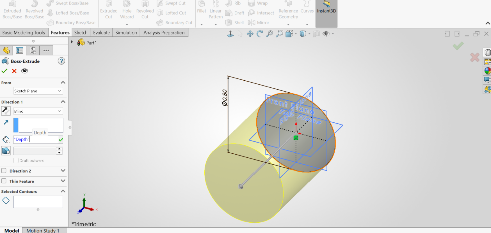

The above shows the extruded sketch from d_A, using the independent variable Depth.

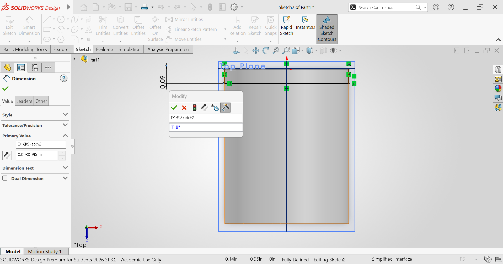

Moving to Feature B, this shows (from the top view) the thickness (T_B) being implemented alongside the already determined length (L_Bnew), which is equal to d_A.

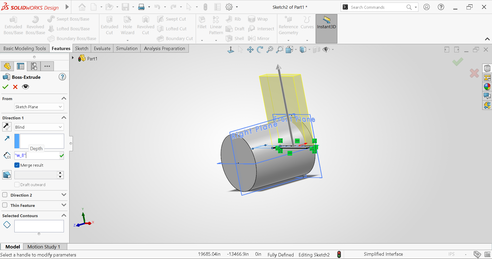

The above shows the extruded width (w_B) being implemented.

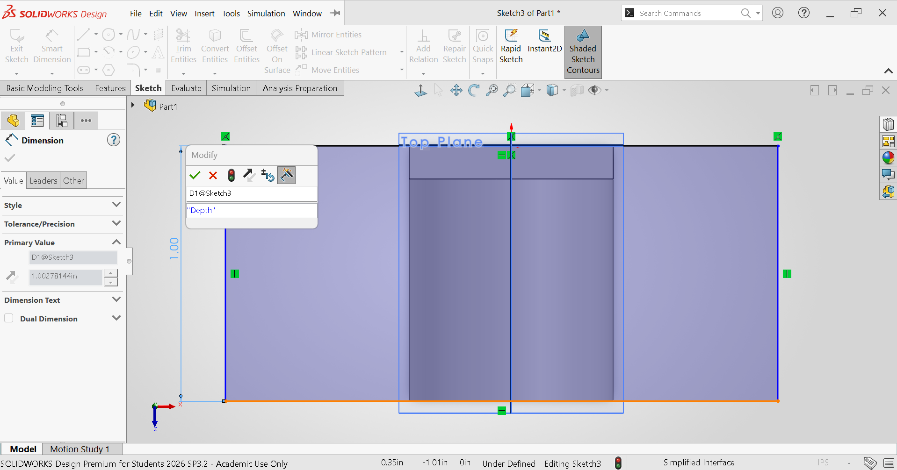

The above shows the assumed symmetrical depth (Depth) that all features have; in this case, Feature C is specifically viewed on the Top plane.

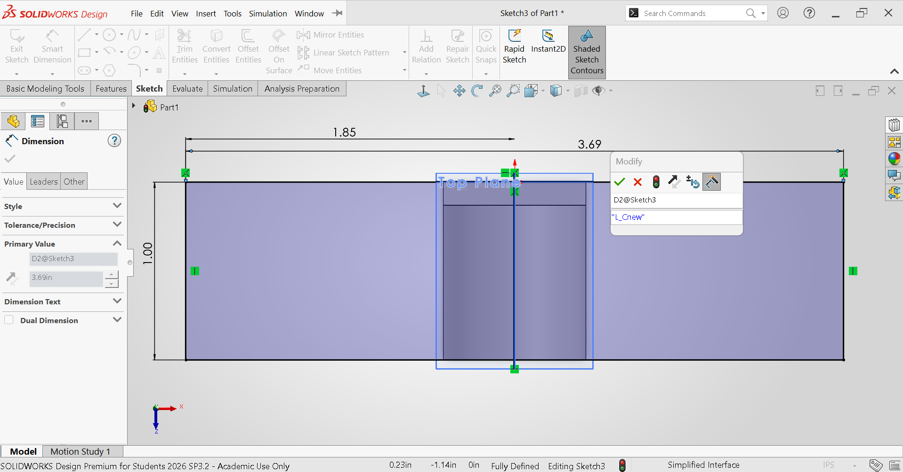

The above shows the length (L_Cnew) being implemented, also placing it evenly on Feature B.

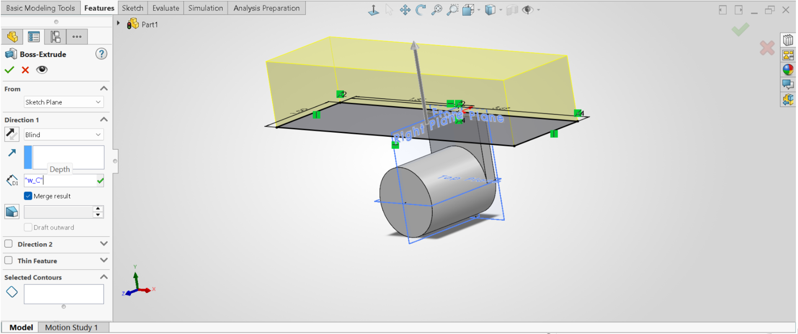

The above shows the extruded width (w_C) being implemented.

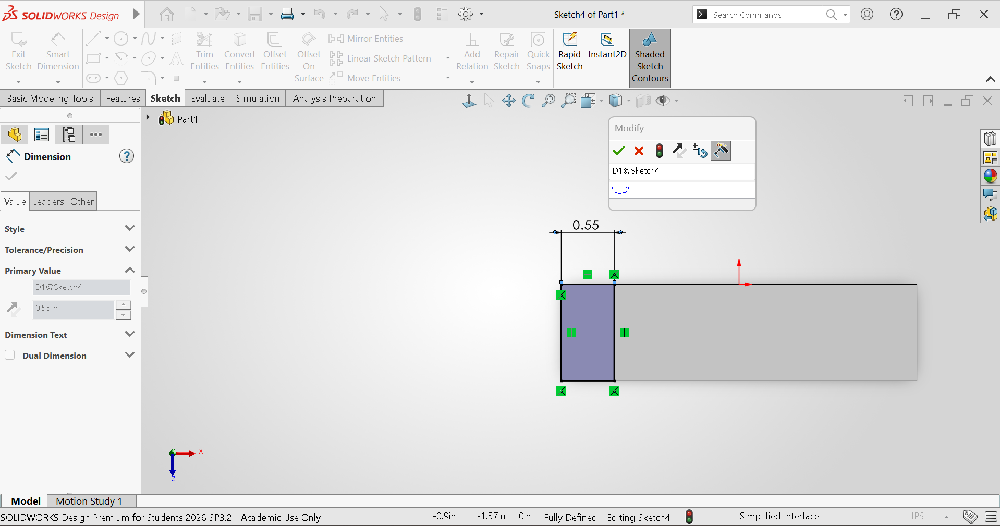

The above shows something similar to what was drawn in Diagram i: the length of Feature D on one side, using the variable L_D.

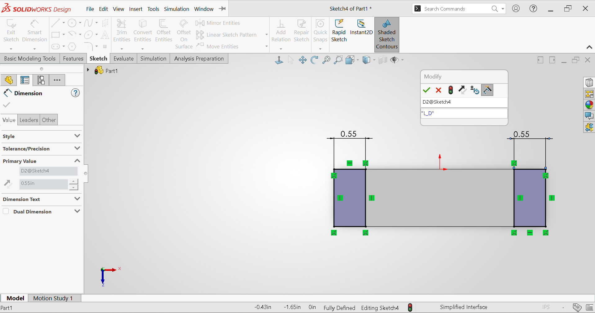

The above shows both features of D being implemented with the same parametric variables.

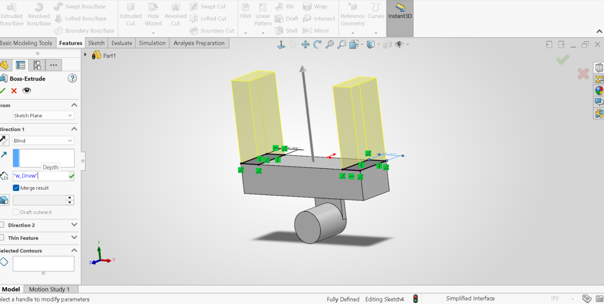

The above shows the extruded width (w_Dnew) being implemented on the sketch of Feature D.

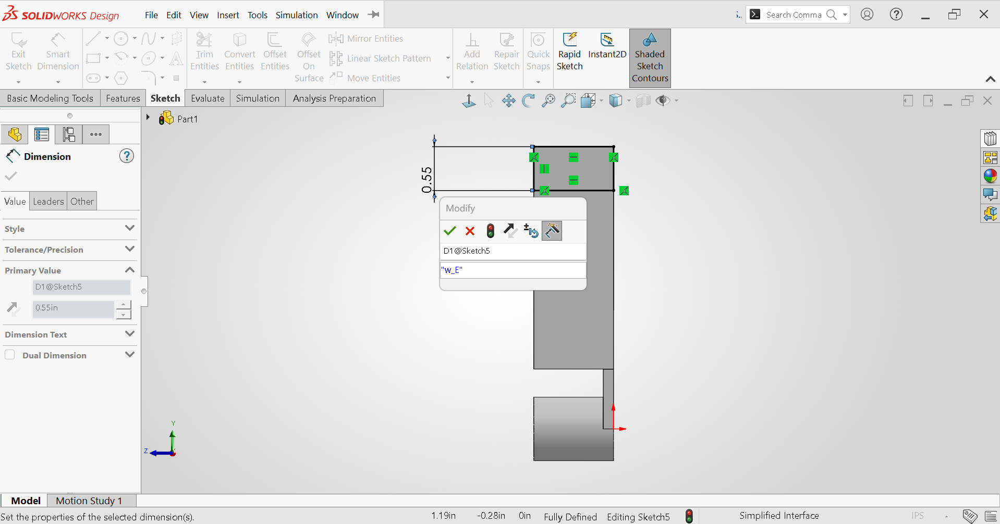

The above shows the sketch of Feature E and the implementation of the parametric variable w_E, which is the width. It is also shown that the Depth is the same as that of all other features from this orientation.

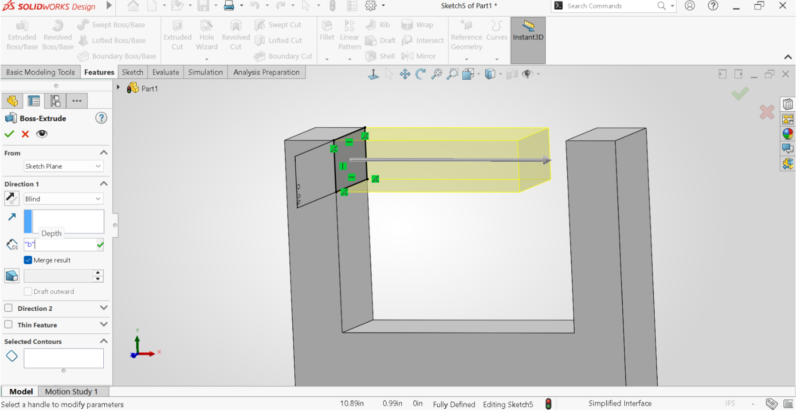

The above shows that the extruded length of feature E is the same as the nominal dimension b.

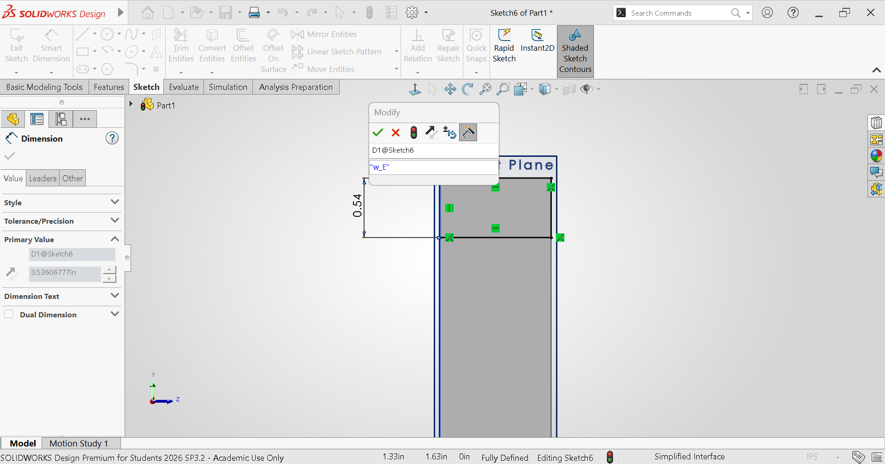

The above shows the other side of Feature E, using the same parametric variable w_E in the sketch, and the depth is the same as Depth.

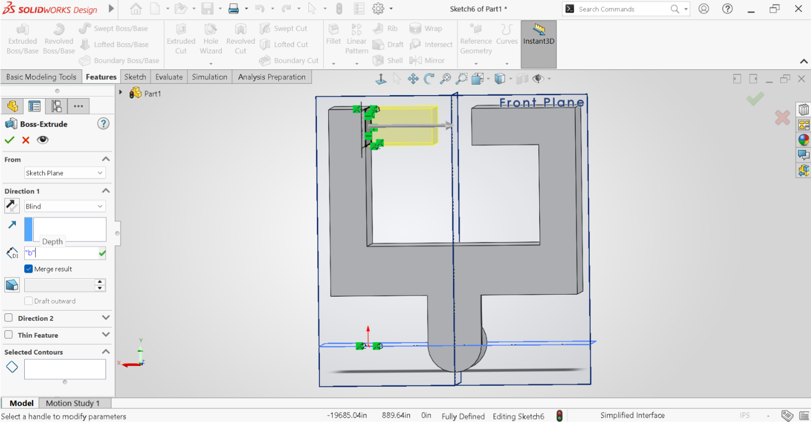

The above shows the extruded length of Feature E, which is also the same as the nominal dimension b.

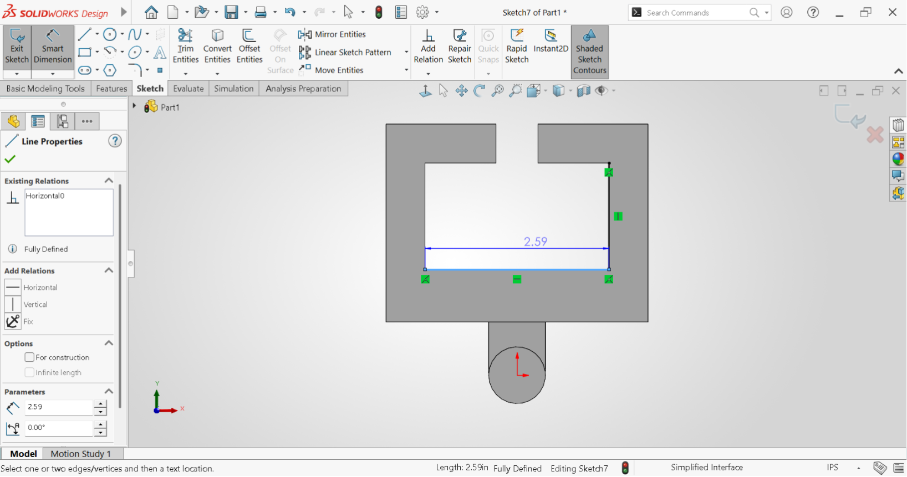

The above shows that the gap length dimension is the same as the total nominal length in Figure 1. The critical design modification of the internal bracket gap length of 2.59 inches in the CAD design is very important in determining the material clearance envelope that will make the slide function properly as a free-running interface. Although the theoretical value for the nominal rigid T-beam rail is 2.4964 inches (a + 2b), the tolerances (+0.000 / -0.001 in) for (a) and (+0.000 / -0.0005 in) for (b), as stated in Figure 1, show that the rail will never be manufactured above its nominal value, which means the zero-clearance line-to-line contact is very prone to binding and possible surface roughness. According to the assignment instructions, dimension "b" is intended to be used where the closest fit that can run freely is needed. Increasing the internal pocket length to 2.59 inches meets this requirement by providing an air gap, which will allow a sliding fit without the risk of binding and manufacturing problems.

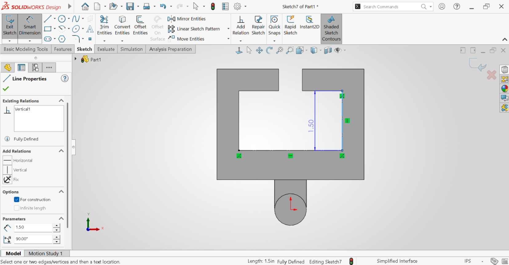

The above shows that the requirement for nominal (c) is met, as shown in Figure 1.

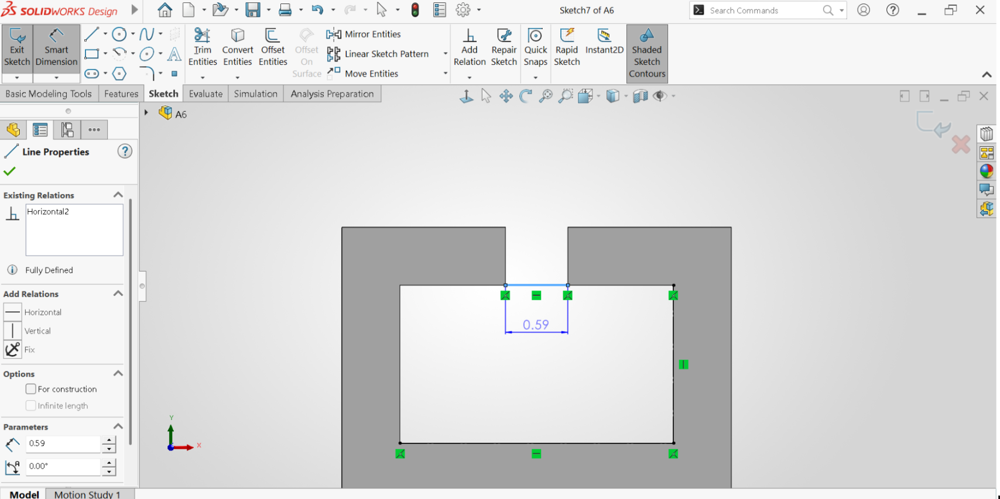

The above shows the gap where the nominal dimension (a) needs to be met. It is a purposeful engineering change in the CAD model for the width of the internal slot cutout to be 0.59 inches. Even though the theoretical nominal size of the rail's top flange comes out to be precisely a = 0.498 inches, it is noted in the guidelines of this assignment that the dimension (a) is classified as an interface where accuracy is not needed. If the cutout in the bracket were to have been designed to fit with line-to-line contact based on the nominal value, there would be no room left for any error at all, which would lead to interference and jamming based on the tolerances inherent in the manufacturing process or even minor misalignment of the parts. It allows us to increase this clearance area to 0.59 inches, making the overall functional loose clearance envelope amount to about 0.092 inches (or 0.046 inches on each symmetrical side).

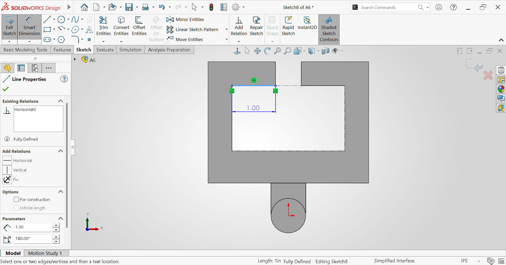

The above shows the gap where the nominal dimension (b) from Figure 1 is met.

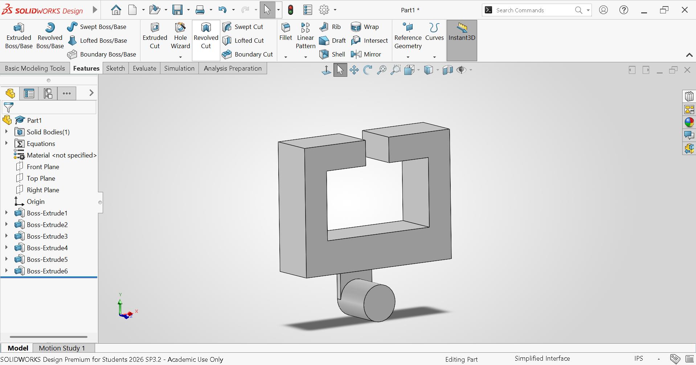

The above shows the CAD model.

## Reflections

### Analytical Modeling and Justification

The parametric model dimensions were primarily defined based on the stress analysis due to the stress values governing all Features except Feature D. Parametrically inputting the cantilever bending for Feature D was defined in the SolidWorks Equations tab as “L_D” = ( (6 * “F” * “b” * FOS) / (“Depth” * (yield)) ) ^ (1/2), linking the load constant of 500 lbf, the safety factor of 4, the dimension “b” T-beam of 0.9992 in., and the yield strength of 40,000 psi directly to the parameter controlling the wall width. As stated previously, Feature D was governed by the stiffness analysis (0.63087 inches); the stress dimensions were still used because the other features were governed by the stress analysis. When design criteria required changing the geometric configuration to reflect the physical clearance gap, the input parameters could be easily updated in the global variables table, and downstream features would respond automatically without manually redefining the dimensions.

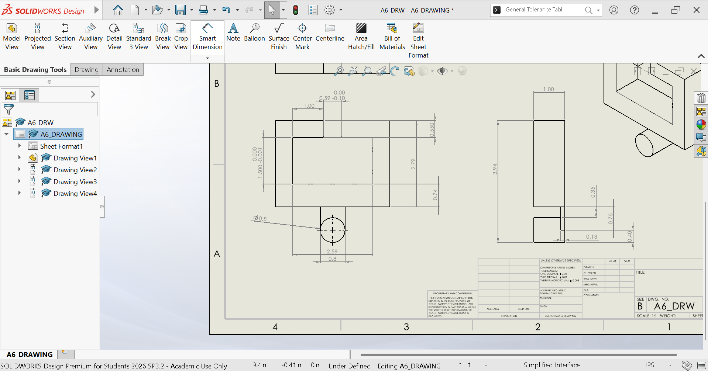
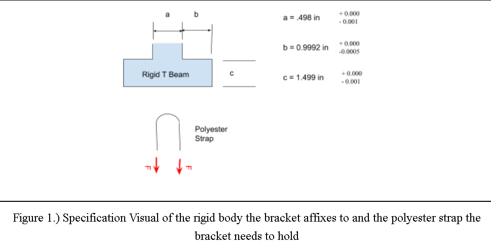

### Tolerance Class Selection and Functional Justifications

As seen above the engineering drawing, a stricter tolerance class to three decimal places was assigned directly to the width of Feature E to accurately position and minimize play due to the moment we assumed Feature E was experiencing over the rigid T-beam rail from the load (0.550 inches). On the other hand, a less restrictive tolerance class was assigned to the diameter of the cylinder pin Feature A (0.8 inches) to serve as a non-critical feature since the strap simply needs to hang on to Feature A. To take into account the sliding interfaces, which are clearly specified by the rail specifications, specific limit callouts have been applied to the nominal "a" gap dimension (0.59 +0.00 / −0.10 in) and the major horizontal clearance gap (1.500 +0.000 / −0.001 in), enabling the drawing to govern exactly the sliding fit of the free-running interface depicted in Figure 1, based on the explanation of nominal dimension "c" that accurate location and minimal play are required.

### Manufacturing Cost Penalties and Feasibility

Applying a uniform tolerance default to all drawings instead of assigning various tolerance classes results in an increase in manufacturing cost and will make the production extremely difficult. Making a machinist work on non-critical parts with a strict three-decimal precision tolerance assignment will force the machinist to precisely and slowly machine tools, use special and expensive machines, and conduct micrometer measurements frequently. The above restrictions are unnecessary and will increase the time spent in the machine shop, causing a high scrap rate due to insignificant, inefficient variations in machining. Therefore, the application of precise, customized limit tolerances to critical mating interfaces and the use of block tolerances for non-mating features enable efficient manufacturing of the bracket.

## Work

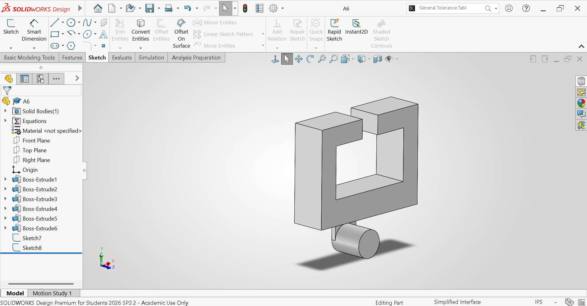
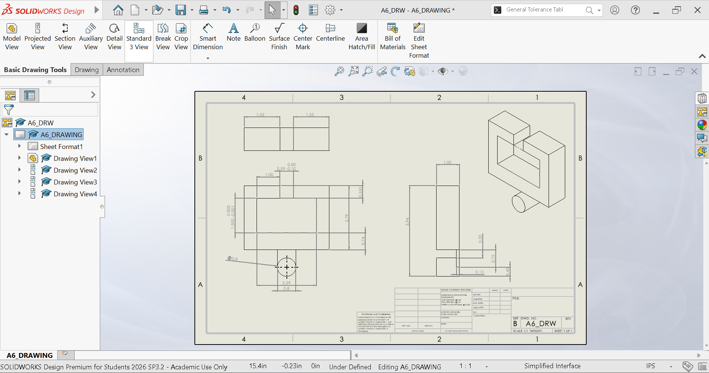

[Work](a6_work.pdf)

[CAD Zipfile](

Time: 8 hours
